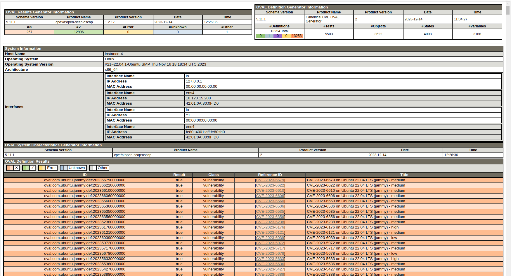

How to know if the Ubuntu image you have launched has addressed a specific CVE?
===============================================================================

This guide will help you determine if a running Ubuntu instance has addressed a specific CVE that you are interested in. We'll heavily rely on the `Ubuntu OVAL`_ tooling developed by the Canonical Security Team to address this question.

To follow the instructions given below, you'll need some sort of command line access to your instance, e.g. SSH.

Install the required packages
-----------------------------

Install the required packages - bzip2 (to uncompress the OVAL data) and OpenSCAP (to scan the instance):

.. code::

    sudo apt update && sudo apt install libopenscap8 bzip2 -y

For more information about OpenSCAP(``oscap``) tooling check out `Documentation for OpenSCAP Base`_.

Scan the instance
------------------

The commands used to scan the instance vary slightly based on whether your instance is running Ubuntu or Ubuntu Pro.

.. tabs::

    .. tab:: Ubuntu

        The following commands will:

        #. Retrieve the name of the Ubuntu release running on your instance
        #. Download the CVE OVAL feed for that release
        #. Extract the XML file from the downloaded archive
        #. Scan the instance, i.e. use the ``oscap`` tool to run an OVAL evaluation using the downloaded OVAL feed

        .. code::

            export $(cat /etc/os-release | grep UBUNTU_CODENAME)
            wget "https://security-metadata.canonical.com/oval/com.ubuntu.${UBUNTU_CODENAME}.cve.oval.xml.bz2"
            bunzip2 "com.ubuntu.${UBUNTU_CODENAME}.cve.oval.xml.bz2"
            oscap oval eval --report report.html "com.ubuntu.${UBUNTU_CODENAME}.cve.oval.xml"

    .. tab:: Ubuntu Pro

        Since an Ubuntu Pro instance is configured with `Expanded Security Maintenance (ESM)`_ apt repositories in addition to the default main repository, ``apt`` will try to download packages from an ESM repository. If it can't find the package there, it will fallback to the main repository. So you need to download and merge the OVAL feeds of both the repositories before running a scan.

        To merge the OVAL feeds, use ``oval-xml-feed-merge``, which can be installed by running:

        .. code::

            sudo snap install oval-xml-feed-merge

        The following commands will:

        #. Retrieve the name of the Ubuntu release running on your instance
        #. Download the CVE OVAL feed for the ESM repositories of that release
        #. Extract the XML file (ESM related) from the downloaded archive
        #. Download the CVE OVAL feed for the main repositories of that release
        #. Extract the XML file (main related) from the downloaded archive
        #. Merge the two XML files 

        .. code::

            export $(cat /etc/os-release | grep UBUNTU_CODENAME)
            wget "https://security-metadata.canonical.com/oval/com.ubuntu.esm-apps_${UBUNTU_CODENAME}.cve.oval.xml.bz2"
            bunzip2 "com.ubuntu.esm-apps_${UBUNTU_CODENAME}.cve.oval.xml.bz2"
            wget "https://security-metadata.canonical.com/oval/com.ubuntu.${UBUNTU_CODENAME}.cve.oval.xml.bz2"
            bunzip2 "com.ubuntu.${UBUNTU_CODENAME}.cve.oval.xml.bz2"
            oval-xml-feed-merge --verbose "com.ubuntu.${UBUNTU_CODENAME}.cve.oval.xml" "com.ubuntu.esm-apps_${UBUNTU_CODENAME}.cve.oval.xml" --output "com.ubuntu.${UBUNTU_CODENAME}-pro.cve.oval.xml" # The order of filenames in this command is important

        The merge tool can only access the home directory, so the OVAL feeds have to be downloaded there. Also, the merging can take a few minutes if you are running an instance with a conservative CPU configuration.

        
        If you are running a release older than five years, run the following commands instead to download and merge the OVAL feeds.

        .. code::

            export $(cat /etc/os-release | grep UBUNTU_CODENAME)
            wget "https://security-metadata.canonical.com/oval/com.ubuntu.esm-apps_${UBUNTU_CODENAME}.cve.oval.xml.bz2"
            bunzip2 "com.ubuntu.esm-apps_${UBUNTU_CODENAME}.cve.oval.xml.bz2"
            wget "https://security-metadata.canonical.com/oval/com.ubuntu.esm-infra_${UBUNTU_CODENAME}.cve.oval.xml.bz2"
            bunzip2 "com.ubuntu.esm-infra_${UBUNTU_CODENAME}.cve.oval.xml.bz2"
            wget "https://security-metadata.canonical.com/oval/com.ubuntu.${UBUNTU_CODENAME}.cve.oval.xml.bz2"
            bunzip2 "com.ubuntu.${UBUNTU_CODENAME}.cve.oval.xml.bz2"
            oval-xml-feed-merge --verbose "com.ubuntu.${UBUNTU_CODENAME}.cve.oval.xml" "com.ubuntu.esm-infra_${UBUNTU_CODENAME}.cve.oval.xml" "com.ubuntu.esm-apps_${UBUNTU_CODENAME}.cve.oval.xml" --output "com.ubuntu.${UBUNTU_CODENAME}-pro.cve.oval.xml" # The order of filenames in this command is important

        Finally,

        7. Run the scans

        .. code::

            oscap oval eval --report report.html "com.ubuntu.${UBUNTU_CODENAME}-pro.cve.oval.xml"

Download the scan report
------------------------

The scan report will be available on your instance as ``report.html`` in the directory where you ran the scan (``oval eval``). You can download it to your local machine using some file transfer service such as ``scp``, and if you open it in a browser you'll see something similar to: 

You can check the *Reference ID* column of the results table for the specific CVE that you are interested in. The colour code indicates if the CVE is addressed on your instance in its current state. A green row indicates an addressed CVE while an amber one indicates otherwise.

.. _`Ubuntu OVAL`: https://ubuntu.com/security/oval
.. _`Documentation for OpenSCAP Base`: https://www.open-scap.org/tools/openscap-base/#documentation
.. _`Expanded Security Maintenance (ESM)`: https://ubuntu.com/security/esm