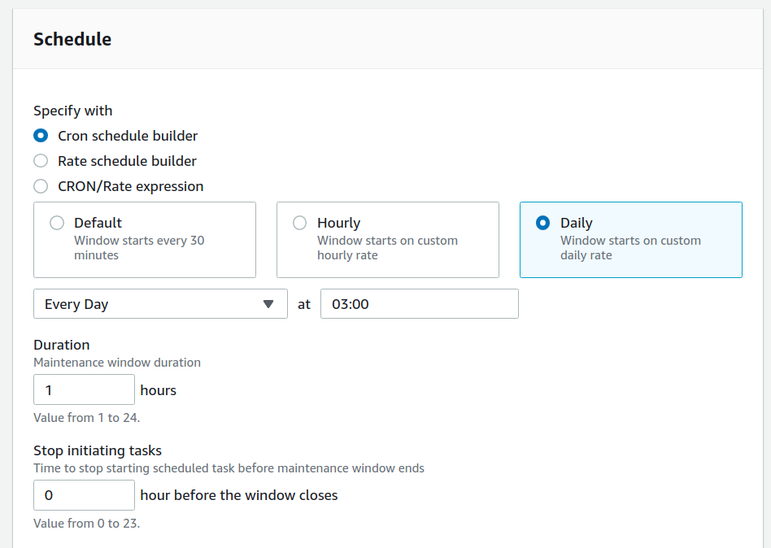

Set up automated updates of Ubuntu instances using AWS SSM
==========================================================

AWS Systems Manager (SSM) can be used to set up automated updates of your Ubuntu and Ubuntu Pro instances. This can be done by creating an automated maintenance window and registering an appropriate run command task for that window.

.. note::

    For the process to work, your Ubuntu instances will need outbound access to port 443 and an SSM agent. All AWS-optimised versions of Ubuntu (16.04 LTS and later) come with the SSM agent pre-installed.

Create an appropriate IAM role
------------------------------

If you don't have an IAM role that allows EC2 instances to call SSM APIs, create one:

* In the IAM console, select :guilabel:`Create role`
* Select :guilabel:`AWS service` under the `Select type of trusted entity` and :guilabel:`EC2` under `Choose a use case` > `Common use cases`
* Select :guilabel:`Next: Permissions`
* In the list of policies to attach to this role, search for "SSM" and select the policy document titled ``AmazonSSMManagedInstanceCore``. Save it and attach it to the instances that you want to update automatically.

Create a maintenance window in SSM
----------------------------------

SSM Maintenance windows allow you to configure time slots for automatically running specific actions. 

* In SSM, select :guilabel:`AWS Systems Manager` > :guilabel:`Maintenance Windows` > :guilabel:`Create maintenance window`
* Provide the maintenance window details:

    * :guilabel:`Name`: `update-ubuntu` 
    * :guilabel:`Description - optional`: `updates Ubuntu using apt and official repositories` 
    * :guilabel:`Unregistered targets`: enable `Allow unregistered targets`

Now schedule the task, by specifying how often you would like to run it, say:

After saving, you should be able to open the new maintenance window page under :guilabel:`AWS Systems Manager` > :guilabel:`Maintenance Windows`.

Register a run command task
---------------------------

A run command task is a set of instructions that you can send to and run in an instance, without having to log into it. It can be a script, a series of commands or even automation documents such as Ansible Playbooks, Chef recipes and other AWS documents created for common tasks like installing a package or updating agents.

To create the task:

* Open the page for the newly created maintenance window and select: :guilabel:`Tasks` > :guilabel:`Register tasks` > :guilabel:`Register Run command task`
* Under :guilabel:`Maintenance window task details` add a name and description for the task:

    * :guilabel:`Name - optional`: `update-and upgrade` 
    * :guilabel:`Description - optional`: `updates and upgrades my Ubuntu instances` 
    
* Under :guilabel:`Command document` select the action (document) that you want to run by searching for ``AWS-RunShellScript`` and selecting it
* Under :guilabel:`Targets` choose the :guilabel:`Selecting unregistered targets` option and then select all the instances that you would like to run the task for. In the list, you will only see the instances that have SSM agent running and are properly configured - i.e. SSM agent installed, roles attached and outbound network access granted. So, if you don't see all the instances that you want, check their roles and security groups.

.. tip::

    If you want to run this task for future instances too, then use the :guilabel:`Selecting registered target groups` option instead. Target groups are configured in `AWS Resource Groups` console and uses tags and other options for grouping instances.

* If you need to store the output from the operation in an external repository such as S3, you could enable it under :guilabel:`Output options`. Otherwise, you can always browse the results from the AWS console.

* Under :guilabel:`Rate control` you can configure:

    * `concurrency` - the number of instances on which you would like to run this task simultaneously
    * `error threshold` - the number of executions after which to stop in case something goes wrong

* Finally, under :guilabel:`Parameters` you'll be able to add the shell commands that you want to run, specify an optional working directory and an optional execution timeout. In the :guilabel:`Commands` text box, add:

.. code::

    sudo apt update
    sudo apt upgrade -y

* Save the changes

