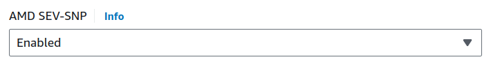

Launch and attest AMD SEV-SNP instances with Ubuntu 24.04 on AWS
================================================================

Amazon EC2 now supports AMD Secure Encrypted Virtualization-Secure Nested Paging (AMD SEV-SNP), on M6a, C6a, and R6a instance types in certain regions. These instances, when used with Ubuntu 24.04 LTS, allow customers to leverage AMD's confidential computing capabilities on AWS.

This guide covers the steps needed to launch, test and validate the AMD SEV-SNP capabilities on AWS. The steps have been tested with  Ubuntu 24.04 LTS and Ubuntu Pro 24.04 LTS on us-east-2.

More information at `AMD SEV-SNP for Amazon EC2 instances <https://docs.aws.amazon.com/AWSEC2/latest/UserGuide/sev-snp.html>`_.

Requirements
-------------

- An AWS account

- Regions to be used: ``us-east-2`` or ``eu-west-1``

- Machine type has to be one of the following: ``c6a.\*, m6a.\*, r6a.\*``

    - General purpose: ``m6a.large | m6a.xlarge | m6a.2xlarge | m6a.4xlarge | m6a.8xlarge``

    - Compute optimized: ``c6a.large | c6a.xlarge | c6a.2xlarge | c6a.4xlarge | c6a.8xlarge | c6a.12xlarge | c6a.16xlarge``

    - Memory optimized: ``r6a.large | r6a.xlarge | r6a.2xlarge | r6a.4xlarge``

Launch the instance
-------------------

After switching to one of the regions mentioned above, launch the instance by enabling a CPU flag under advanced CPU options. 

You can do it using either the AWS EC2 console or AWS CLI.

If using AWS EC2 Console, scroll down to the Advanced details section and within it, scroll down to AMD SEV-SNP selector and select Enabled.

If using AWS CLI, add ``--cpu-options AmdSevSnp=Enabled`` to your command:

.. code::

    $ aws ec2 run-instances \
    --image-id supported_ubuntu_ami_id \
    --instance-type supported_instance_type \
    --key-name key_pair_name \
    --subnet-id my_subnet_id \
    --cpu-options AmdSevSnp=enabled

Once the machine is running, you can check if AMD SEV-SNP was enabled by looking at the instance details on the EC2 console or using the AWS CLI command ``ec2 describe-instances`` API. ``AmdSevSnp`` should be in the CpuOptions

More information at: `Check AMD SEV-SNP support on Amazon EC2 instances (AWS Site) <https://docs.aws.amazon.com/AWSEC2/latest/UserGuide/snp-work.html>`_

Build the attestation tool (snp guest tools)
--------------------------------------------

For the attestation process (which allows the instance to prove its state and identity), we are going to use the SNP guest tools available at `<https://github.com/virtee/snpguest/tree/main>`_.

More information at: 

* `<https://docs.aws.amazon.com/AWSEC2/latest/UserGuide/snp-attestation.html>`_
* `<https://github.com/virtee/snpguest/tree/main>`_

1. Install the requirements

    - Install the compiler to build the tool:
        
    .. code:: 

            sudo apt install build-essential

    - Install rust: 

    .. code:: 

        curl --proto '=https' --tlsv1.2 -sSf https://sh.rustup.rs | sh
        source "$HOME/.cargo/env"

2. Clone the ``snpguest`` repository:

.. code:: 

    git clone https://github.com/virtee/snpguest.git
    cd snpguest

3. Build (~12 minutes)

.. code:: 

    cargo build -r

Get the attestation report and validate it
------------------------------------------

Get the attestation report (``report.bin``) using a randomly generated  text file (``request-file.txt``)

.. code::

    cd target/release
    sudo ./snpguest report report.bin request-file.txt --random
    sudo ./snpguest certificates pem ./

Download the VLEK root of trust certificates from AMD for validation:

.. code::

    sudo curl --proto '=https' --tlsv1.2 -sSf https://kdsintf.amd.com/vlek/v1/Milan/cert_chain -o ./cert_chain.pem

(Optional) Use openssl to validate the certificate:

.. code::

    sudo openssl verify --CAfile ./cert_chain.pem vlek.pem

Use ``snpguest`` to validate that the attestation report is signed by the VLEK certificate.

.. code::

    sudo ./snpguest verify attestation ./ report.bin

The expected output should be:

.. code::

    Reported TCB Boot Loader from certificate matches the attestation report.
    Reported TCB TEE from certificate matches the attestation report.
    Reported TCB SNP from certificate matches the attestation report.
    Reported TCB Microcode from certificate matches the attestation report.
    VEK signed the Attestation Report!

The last line shows that the certificate is valid.
