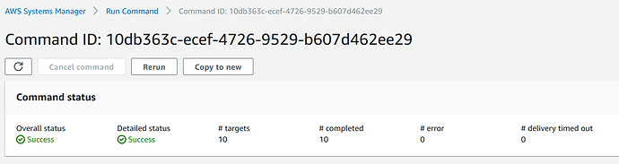

Upgrade to Ubuntu Pro at scale using tokens with SSM
====================================================

Overview
---------

Ubuntu Pro expands Ubuntu LTS’ 5 years of coverage up to ten-years of security coverage with an additional support of 23,000 packages beyond the main operating system and it is free for use on up to 5 machines!

There are three ways to get Ubuntu Pro on AWS:

    1. Launching an Ubuntu Pro machine from the AWS Marketplace, which is ready to use through a pay-as-you-go pricing model.
    2. Attaching an Ubuntu Pro token to any running Ubuntu LTS server using AWS Systems Manager (SSM)
    3. Upgrading to Ubuntu Pro using AWS License Manager

This how-to will cover the second case: Activating Pro via token using AWS Systems Manager.

There are many ways to automate actions on AWS Systems Manager but for this how-to, we are going to use SSM Documents and the Run Command functionality.

Prerequisites
-------------

- An AWS account
- An Ubuntu One account (you can create one on `Ubuntu Pro | Ubuntu <https://ubuntu.com/pro>`_)
- Machines with SSM agent installed (available by default on Ubuntu 16.04 onwards). If the agent is properly configured, the servers will appear as Managed Nodes on AWS SSM Fleet Manager (see the reference links for more information)
- Basic understanding about writing and running SSM Documents (see the reference links for more information)

Get a token
------------

To get an Ubuntu Pro token, you need to create an account in `Ubuntu Pro | Ubuntu <https://ubuntu.com/pro>`_ to see your subscriptions and get your tokens. Anyone can use Ubuntu Pro for free on up to 5 machines, even for production workloads.

Log-in by clicking on *Your subscriptions*. You will be redirected to the following screen where the token is exposed as shown in the orange ellipse:

.. image:: upgrade-to-ubuntu-pro-at-scale-using-tokens-with-ssm-images/0_token_screen.png
   :align: center

Create a SSM Document to attach the token
------------------------------------------

The SSM Document is just a JSON or YAML file containing the script in steps or sections.

    Note:
    As the token is personal, it is not recommended to hard-code it into the code but add it as a user parameter.

This is the full code:

.. code-block::

    ---
    schemaVersion: '2.2'
    description: "Enable Pro services using a Pro token"
    parameters:
    token:
        type: String
    mainSteps:
    - action: aws:runShellScript
    name: update
    inputs:
        runCommand:
        - "sudo apt-get update && sudo apt-get upgrade -y"
    - action: aws:runShellScript
    name: attachToken
    inputs:
        runCommand:
        - "sudo pro attach {{ token }}"
    - action: aws:runShellScript
    name: updateWithESM
    inputs:
        runCommand:
        - "sudo apt-get update && sudo apt-get upgrade -y"

The token will be requested to the user when running this document, then it will execute the rest of the code:

    1. Run an update (to make sure the pro agent is at the latest version)
    2. Attach the token
    3. Update again in case you have installed software that could get security updates from Pro repositories.

No reboot is needed.

Run the SSM script
------------------

The SSM script can be run either from the Fleet Manager or with the SSM Run Command. More information can be found in `this tutorial <https://ubuntu.com/tutorials/how-to-create-ssm-documents-and-use-them-to-install-packages-massively-with-run-command#1-overview>`

You don’t need to restart the machines after applying the token. If the SSM script fails, check the SSM format of your document, see if there are any typos and try again. If this does not work check the output generated by SSM and look for any configuration issue (do your machines have access to update and upgrade packages? Pro repositories are available on different endpoints [[than what?]]. Check the references at the end of the tutorial).

Check the Pro status of your machine
----------------

You can always check the status of the subscription by running: 

.. code-block::
    
    sudo pro status 

and see entitlements and enabled services.

Additional resources and links
------------------------------

- `Getting started with Ubuntu Pro <https://ubuntu.com/engage/aws-pro-onboarding>`_
- `Running scripts at scale on SSM with Run Command and SSM Documents <https://ubuntu.com/tutorials/how-to-create-ssm-documents-and-use-them-to-install-packages-massively-with-run-command#1-overview>`_
- `Enabling SSM and using SSM Session Manager on Ubuntu <https://ubuntu.com/tutorials/how-to-use-aws-ssm-session-manager-for-accessing-ubuntu-pro-instances#1-overview>`_
- `AWS Systems Manager documentation (AWS) <https://docs.aws.amazon.com/systems-manager/index.html>`_
- `Creating SSM Documents (AWS) <https://docs.aws.amazon.com/systems-manager/latest/userguide/create-ssm-doc.html>`_
- `Ubuntu Pro on AWS <https://ubuntu.com/aws/pro>`_
- `Network requirements for Pro ESM repositories <https://github.com/canonical/ubuntu-advantage-client/blob/main/docs/references/network_requirements.md>`_

