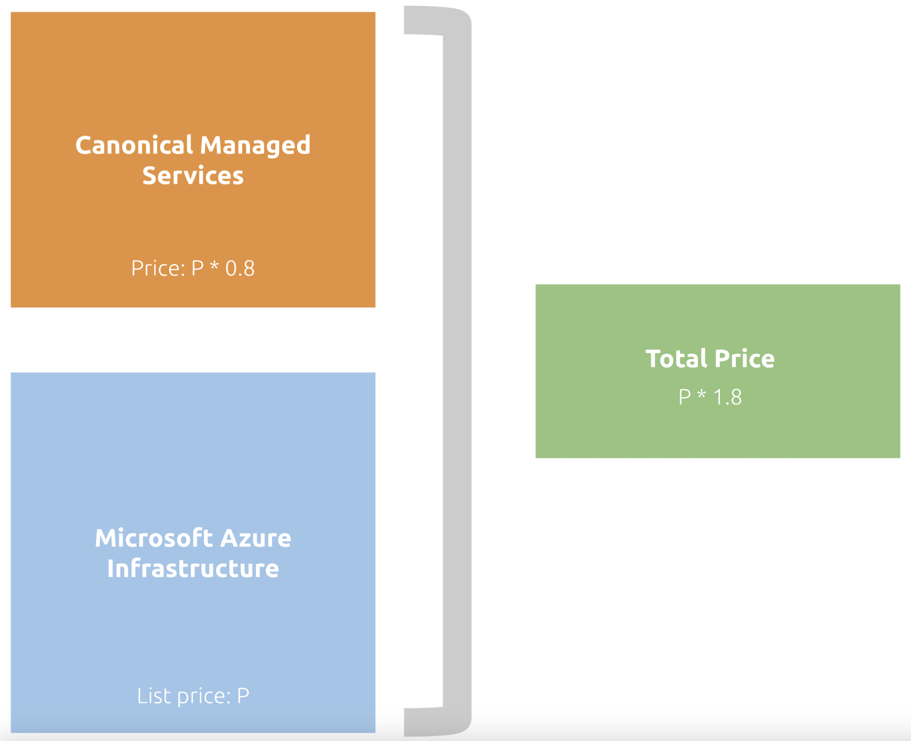

Pricing of managed services
===========================

Pricing model
-------------

Canonical's managed applications on Microsoft Azure are priced using a dynamic algorithm, meaning there is no set price per node. For the managed services provided by Canonical, you will be charged an additional 80% of the list price of the Azure compute infrastructure your deployment is using, measured in real time against usage metrics within your resource group. 

Billing will be incurred automatically through your Microsoft Azure account during each billing cycle. You will only pay one bill, directly to Microsoft Azure, and will never have to pay anything directly to Canonical for this service. The following infographic shows the way your total cost will be calculated at the end of each billing cycle: 

Billable resources
------------------

When you create a managed application deployment, the Microsoft Azure engine will create a new resource group. By subscribing to a managed application with Canonical, you are granting Canonical the rights to manage this resource group on your behalf. For more information, refer to `Azure's documentation about managed applications`_. 

We will charge for our managed services based on all compute infrastructure in this resource group, which we monitor throughout the billing cycle to an accuracy interval of one minute. If you decommission a node, you will stop paying for the associated managed services, and if you deploy a new node, you will only pay from when it was created. This applies to all nodes within the environment covered by Canonical's managed services, whether they are manually created or automatically deployed. This also applies to spot instances. 

.. _`Azure's documentation about managed applications`: https://learn.microsoft.com/en-us/azure/azure-resource-manager/managed-applications/overview

