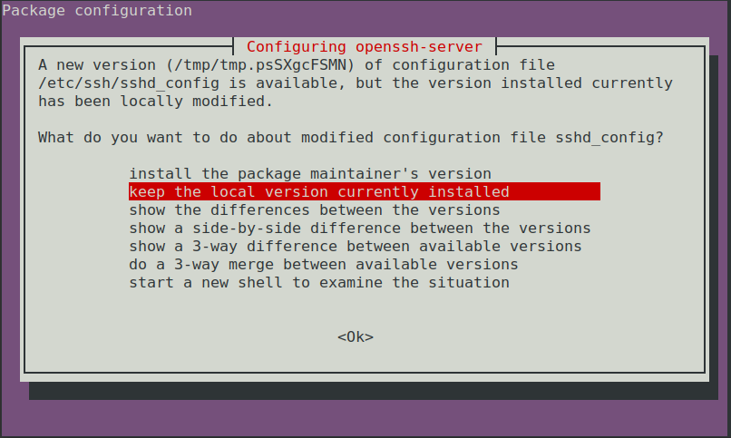

# Upgrading from Focal to Jammy on Oracle

## General Advice
When deciding how to upgrade the main consideration is whether your system can be setup/deployed with automation or requires manual configuration.

Running [`do-release-upgrade`](https://manpages.ubuntu.com/manpages/focal/man8/do-release-upgrade.8.html) requires some manual intervention ([see Manual upgrade steps](#manual-upgrade-steps)), which makes it a good option for systems which require manual configuration and cannot be easily created or destroyed.

For system deployments which are fully automated it is recommended to redeploy with new Jammy instances instead of upgrading from Focal.

## Manual upgrade steps
If you are upgrading from Focal to Jammy you can expect to run into the following prompts requesting manual input.

### Additional SSH daemon
When upgrading in a session over SSH there is an inherent risk of losing access if something goes wrong with the SSH daemon. To mitigate this risk an additional SSH daemon is started on a different port as a backup.

### Optional firewall rules for additional SSH daemon
If you are using a firewall there is a chance the port used by the backup SSHD is not open. Opening this port is not done automatically since it could be security risk.

### Start upgrade
A final prompt before starting the upgrade. Information regarding the amount of changes and estimated time are provided because once you start the upgrade process it cannot be cancelled.

### Restart services automatically
Some services need to be restarted when certain libraries are upgraded. The user has the option to allow the system to automatically restart these services or to be asked after every library upgrade which services they want to be restarted.

### Iptables configuration modified
Canonical makes changes to `/etc/iptables/rules.v4` and `/etc/iptables/rules.v6` for Oracle images. As a result when upgrading there will be a prompt asking whether to save current IPv4 and IPv6 rules even if no user changes were made. If additional changes to iptables rules were made, selecting `Yes` is recommended if preserving those added rules is desired.  Selecting `No` will use the prexisting persistent `rules.v4` and `rules.v6` which contain the Canonical changes, unless previously modified.

### SSHD configuration modified
Canonical makes changes to `/etc/ssh/sshd_config` for Oracle images. As a result when upgrading there will be a prompt asking whether to keep this version, use the default in the newer version or take some other action.

### Remove obsolete packages
An obsolete package is a package which is no longer available in any of the sources for Apt. Usually it is safe and recommended to remove obsolete packages but you can verify which packages would be removed before doing so.

### Restart to finish upgrade
A restart will be necessary for some parts of the upgrade to be applied. If you select no to the restart you can check `/var/run/reboot-required.pkgs` to see which things need a reboot to be applied.

