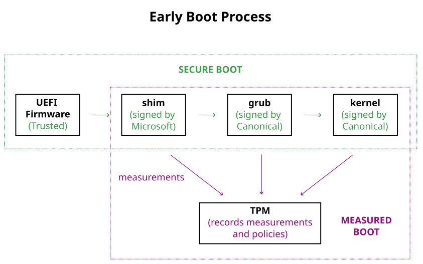
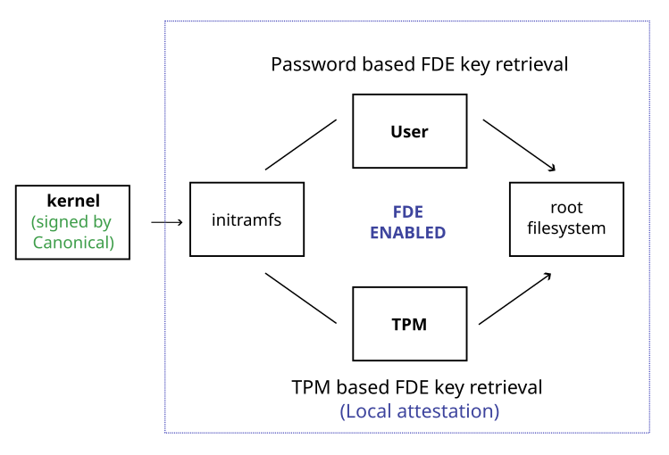
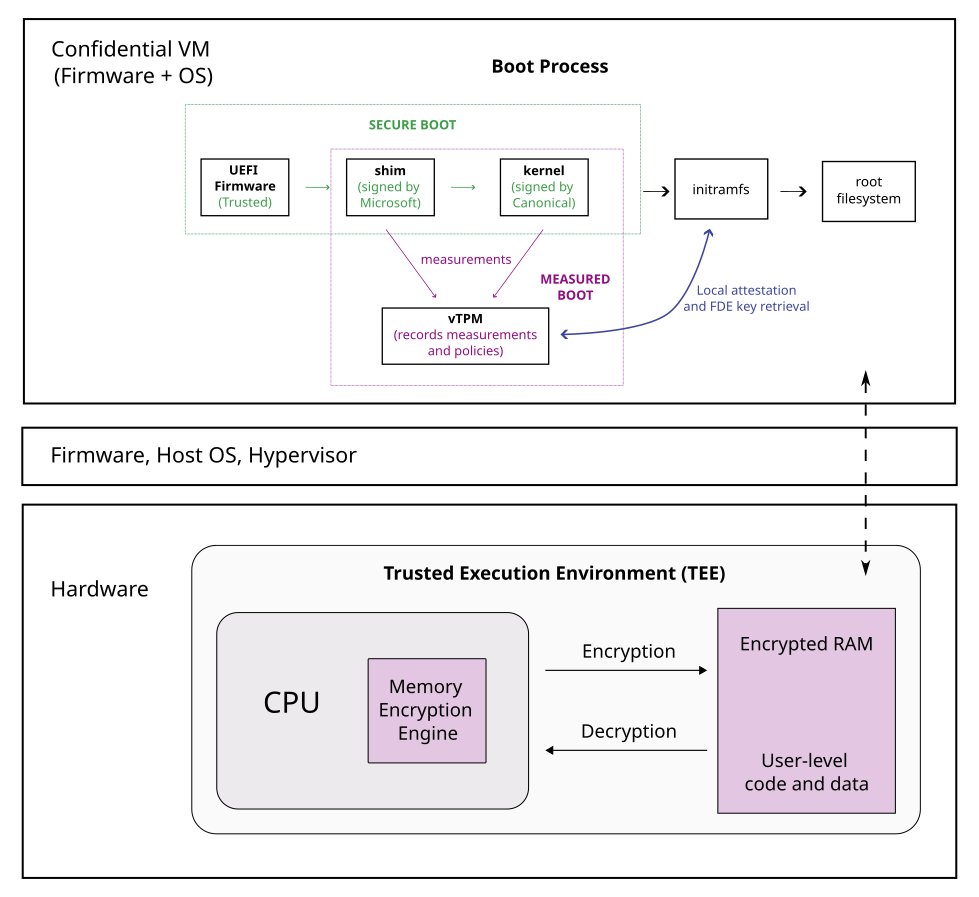

Security in the Ubuntu cloud images
===================================

All the Ubuntu cloud images inherit the security features implemented in Ubuntu. Ubuntu's security strategy includes multiple defense mechanisms, each addressing a unique threat as explained below. You can choose to use the ones that are best suited for your environment.

CVE handling, Kernel Livepatch
-------------------------------
Defense against known vulnerabilities
~~~~~~~~~~~~~~~~~~~~~~~~~~~~~~~~~~~~~

To defend against known vulnerabilities (`CVEs`_), you need to monitor them and patch them with security updates. Each LTS release of Ubuntu includes five years of security updates for the ~2300 packages available in the main repository. With `Expanded Security Maintenance (ESM)`_, which is available as part of Ubuntu Pro, this expands to up to 12 years and includes an additional ~34000 packages from the universe repository.

Ubuntu Pro also supports `Kernel Livepatch`_, a feature that allows patching of high and critical kernel vulnerabilities at run-time, without requiring an immediate reboot. This allows one to remain secure while deferring unplanned reboots for up to a year.

Hardening (DISA STIG, CIS)
--------------------------
Guarding against misconfigurations
~~~~~~~~~~~~~~~~~~~~~~~~~~~~~~~~~~

To avoid weaknesses in the system setup, you need to harden your system through robust and secure configurations. Ubuntu LTS releases are configured to enable a balance between usability, performance and security. However, security best practices recommend hardening systems beyond the defaults to reduce the attack surface. This involves actions such as:

* Securing network services like SSH
* Removing unnecessary software packages
* Configuring strict file permissions
* Disabling unused hardware ports and 
* Ensuring robust logging

Comprehensive hardening guidance is available through established standards like the CIS Benchmarks and DISA STIGs. Canonical produces tailored hardening profiles and tools (`the Ubuntu Security Guide (USG)`_) for Ubuntu based on these standards. 

FIPS
----
Strengthening cryptographic integrity 
~~~~~~~~~~~~~~~~~~~~~~~~~~~~~~~~~~~~~

Cryptographic algorithms (or their implementations) could include flaws that can be exploited. You can mitigate this risk by using validated cryptographic modules, more specifically by using FIPS-certified modules.

`FIPS`_ is a standard that ensures cryptographic modules meet specific security requirements. FIPS compliance is a requirement for U.S Federal agencies, their contractors and for industries where data security is heavily regulated, such as financial services (PCI-DSS) and healthcare (HIPAA).

Ubuntu Pro, the premium version of Ubuntu, offers FIPS compliance out-of-the-box through FIPS-certified modules for all cryptographic functions.

AppArmor
--------
Protection against unauthorized access
~~~~~~~~~~~~~~~~~~~~~~~~~~~~~~~~~~~~~~

Even with timely patching, applications might have unknown vulnerabilities that could be exploited to gain unauthorized access. In this case, you need an inbuilt mechanism for restricting access, such as AppArmor.

`AppArmor`_ enforces Mandatory Access Control through profiles that define strict limits on what applications can access and do, effectively containing potential exploit pathways, even for unknown vulnerabilities.

Ubuntu comes pre-installed with a range of AppArmor profiles for common applications. Furthermore, if your critical workload application doesn't have a profile, it is straightforward to create one. To generate a new profile, AppArmor can be put into Complain-mode while the application runs with its full range of capabilities. The actions taken by the application will get captured in a file. This file can then be used as a new profile for Enforce-mode, where any deviations from the expected actions will be restricted.

Verified Boot, TPM, FDE 
-----------------------
Securing early boot software
~~~~~~~~~~~~~~~~~~~~~~~~~~~~

A highly sophisticated attack could involve modifying the early boot software - the foundational components responsible for initializing the hardware, verifying components, and loading the OS. Tampering with these allows a malware to execute with the highest privileges, even before the OS security mechanisms are loaded. To thwart this type of an attack, two techniques are used:

Verified Boot (aka “Secure Boot”)
^^^^^^^^^^^^^^^^^^^^^^^^^^^^^^^^^

It enforces a chain of trust during the boot process, preventing unauthorized code from running and ensuring that only signed, trusted software is loaded. Each component in the boot chain verifies the signature of the next component before letting it execute. If any component fails verification, the boot process halts immediately, preventing the execution of untrusted code.

Measured Boot
^^^^^^^^^^^^^
It uses a hardware-based tamper-resistant log such as a Trusted Platform Module (TPM) to verify the integrity of boot components. The components are measured and their hash values are compared to expected ones. This ensures that no tampering has occurred, including one where an attacker replaces a component with an older version that is signed and trusted, but includes unfixed vulnerabilities. 

These security measures are only useful if the OS on the disk is independently protected using the next technique - Full Disk Encryption. 
 
Full Disk Encryption (FDE)
^^^^^^^^^^^^^^^^^^^^^^^^^^
It ensures that all data on the disk is inaccessible without an encryption key, safeguarding the device even if an attacker gains physical access.

Towards the end of the boot process, the root file system needs to be loaded. If FDE is enabled, then the disk needs to be decrypted before the root file system can be loaded. The decryption key for this can be obtained either from the user or from the TPM (if TPM-backed FDE is enabled).

TPM-backed FDE includes an additional security check called local attestation before the disk is allowed to be decrypted. This check ensures that the measurements recorded during measured boot match the expected values as specified in a policy (stored in the TPM).

Confidential computing
----------------------
Defense against a malicious host
~~~~~~~~~~~~~~~~~~~~~~~~~~~~~~~~

In a cloud environment, it is possible that the host on which you are running a VM is compromised. Even if you were to use FDE to protect data at rest on disk, data remains vulnerable when in use — when loaded into RAM or processed by the CPU.

Confidential Computing mitigates this problem by encrypting your data when it is in use and by preventing unauthorized access by the host system. This is achieved by creating a hardware-based trusted execution environment (TEE) - an environment where the data stored in the RAM is encrypted and a specialized CPU (such as AMD SEV or Intel TDX) is used to control access to this data.

The specialized CPU uses an AES encryption engine within its memory controller to encrypt and decrypt memory pages with each read/write operation. A new encryption key is generated for each VM and it is protected and managed at the hardware level. It cannot be accessed by any of the cloud's privileged system software nor its administrators. Furthermore, these CPUs incorporate new instructions and data structures that help detect replay attacks and unauthorized modifications of the memory pages. For instance, with the new instructions a read operation can return the last written value along with the current value. This can then be used to detect unexpected changes.

Any VM deployed on and capable of using such hardware is called a Confidential Virtual Machine (CVM). If the VM is running Ubuntu, all the other security features mentioned above can also be enabled. 

Finally, it is also possible to verify that a CVM is actually launched on confidential-computing capable hardware without having to take the cloud provider's word for it. This can be done through remote attestation of the TEE. By verifying the signed quote sent by the TEE, it is possible to ensure two things: (1) that the cloud's TEE hardware used is genuine and (2) that the software loaded into the TEE has not been tampered with.

.. _`the Ubuntu Security Guide (USG)`: https://ubuntu.com/security/certifications/docs/usg
.. _`CVEs`: https://ubuntu.com/security/cves/about
.. _`Kernel Livepatch`: https://ubuntu.com/security/livepatch
.. _`Expanded Security Maintenance (ESM)`: https://ubuntu.com/security/esm
.. _`FIPS`: https://ubuntu.com/security/fips
.. _`AppArmor`: https://documentation.ubuntu.com/server/how-to/security/apparmor/