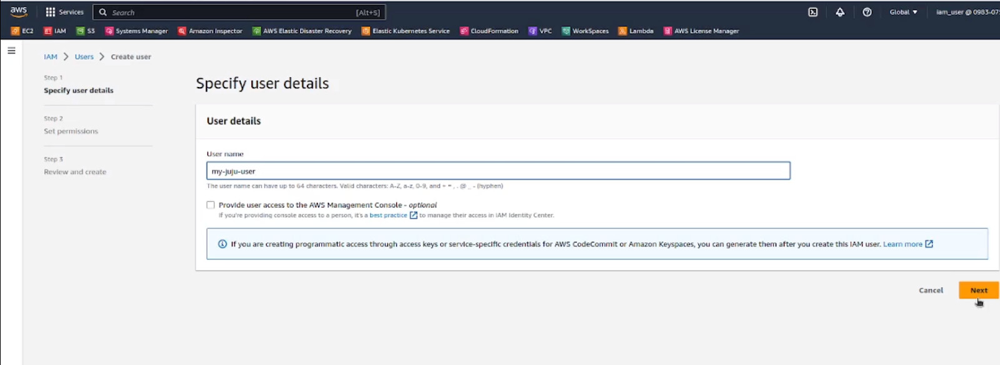
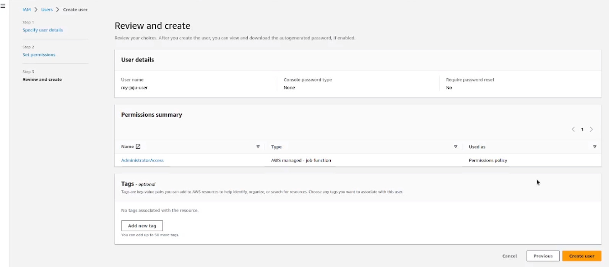
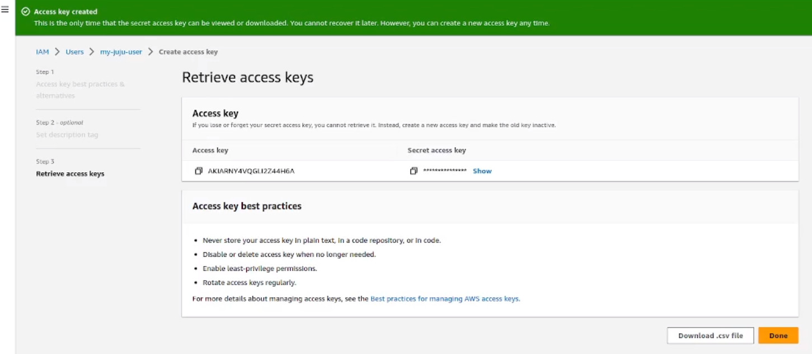
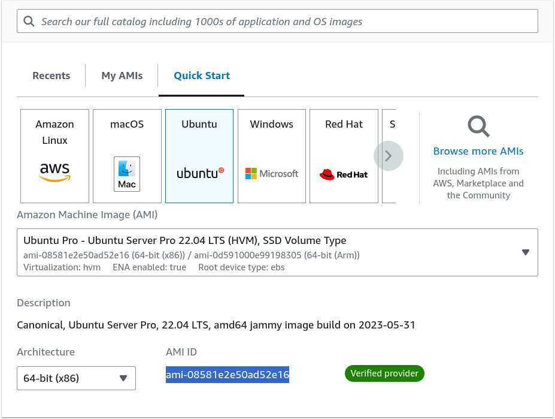
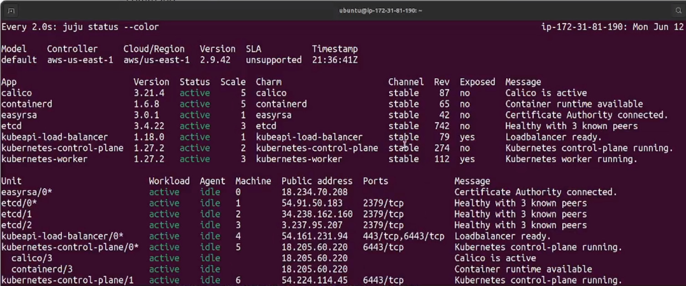
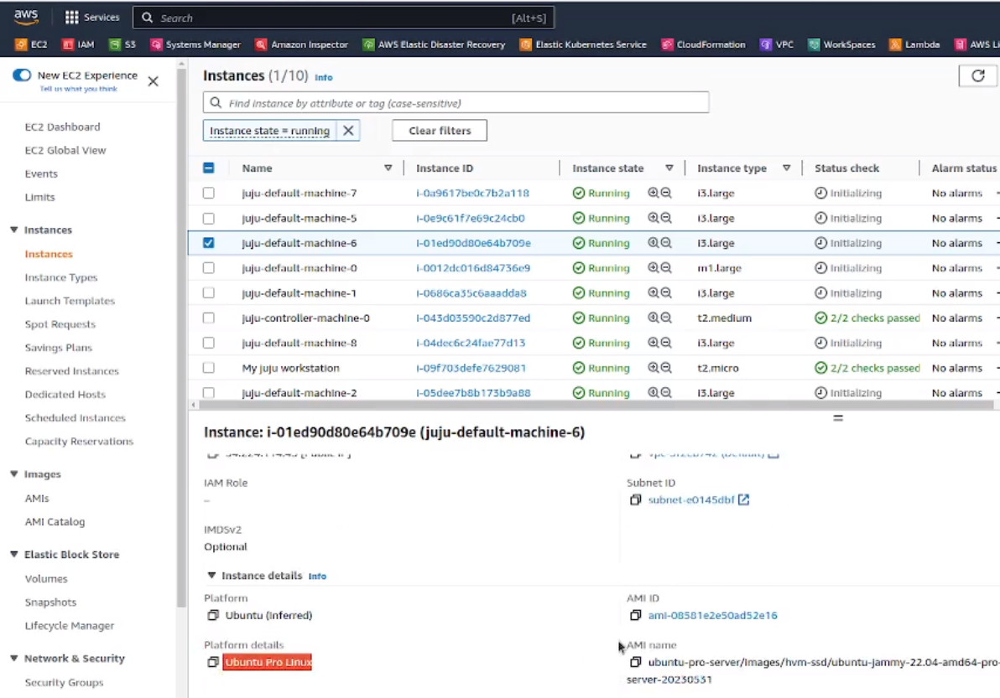

Deploy Charmed Kubernetes on Ubuntu Pro on EC2
==============================================

This guide shows you how to deploy Charmed Kubernetes on Ubuntu Pro EC2 instances.

Although the process is similar for a deployment on Ubuntu Server, Ubuntu Pro is chosen here since it provides the Kubernetes cluster with additional security and compliance benefits. These benefits include improved server uptime (with Livepatch) and the ability to run Canonical's `premium container images`_.

To perform the steps outlined in this guide, you'll need an AWS account. A basic idea about `Juju`_ and Kubernetes might also come in handy.

Create a Juju workstation
--------------------------

To deploy Charmed Kubernetes, you'll need a workstation with Juju installed on it. This could be your local machine or an EC2 instance. 

If you are using EC2, launch an instance with Ubuntu and SSH into it. It doesn’t have to be a big machine and can be turned off later to save costs. Wait till cloud-init completes and then install Juju:

.. code-block::

   cloud-init status --wait
   sudo snap install juju --classic

Configure AWS credentials
-------------------------

Before we can start the procedure, we need to add the AWS credentials. If you already have existing AWS credentials, you can :ref:`skip to the end of this step <add AWS credentials>` where they are configured into Juju. 

To create new credentials, create a new user either through the AWS CLI (if you have that installed) or through the IAM service in the AWS web console. We only need the access keys for programmatic access, so create a new user without console access:

On the next screen, select :guilabel:`Attach policies` and preferably attach a policy keeping the principle of least privilege in mind. For the sake of simplicity, this example uses admin access.

Once the user is created, go to the security credentials tab of that user and create an access key. Specify *Other* as the 'Use case' in the next screen and save the access credentials from the final screen:

.. _add AWS credentials:

Finally, back on the workstation, use Juju to add these AWS credentials:

.. code-block::

   juju add-credential aws

Follow the wizard - give a name to the credential, select a region, enter the access key and enter the secret key (which remains invisible) - to complete the process.

Initialize the Juju control plane
---------------------------------

Next, initialize the Juju control plane using Juju bootstrap and follow the wizard to configure region, names, etc.

.. code-block::

   juju bootstrap

Get Ubuntu Pro AMI ID
---------------------

To set Ubuntu Pro as the base image for your cluster nodes, you need to get the correct AMI ID. If you already have the AMI ID, you can skip this step. If not, use one of the following two options to get the AMI ID for Ubuntu Pro 22.04 LTS for your region.

Using AWS CLI
~~~~~~~~~~~~~

If it is not already installed, `install AWS CLI`_ on the workstation and use it to query EC2 for the Ubuntu Pro AMI ID:

.. code-block::

   aws ec2 describe-images --output text --owner 099720109477 --region us-east-1 --filters "Name=name,Values=ubuntu-pro-server/images/hvm-ssd/ubuntu-*22.04-amd64*" --query 'sort_by(Images, &CreationDate)[-1].{ImageId:ImageId}'

Using the EC2 console
~~~~~~~~~~~~~~~~~~~~~

On the EC2 console, select :guilabel:`Launch instances`. On the next screen, select 'Ubuntu' under the Quick Start menu, followed by 'Ubuntu Pro 22.04 LTS' in the AMI selector drop-down. This will show the required AMI ID as part of the selection:

Set Ubuntu Pro as your base AMI
-------------------------------

Use the add-image command to set the obtained AMI ID as your base AMI. The command also needs you to specify the series: focal, jammy, etc.

.. code-block::

   juju metadata add-image --series jammy ami-08581e2e50ad52e16

Deploy Charmed Kubernetes
-------------------------

Run the Juju deploy command to deploy `Charmed Kubernetes`_  and keep a watch on the deployment status.

.. code-block::

   juju deploy charmed-kubernetes
   watch -c juju status --color

After about 30 minutes, everything should be green:

Also, on the EC2 console all nodes should be running Ubuntu Pro:

Control your new Kubernetes environment
---------------------------------------

To manage your new Kubernetes environment, install and configure ``kubectl``.

Install ``kubectl``:

.. code::

   sudo snap install kubectl --classic

Use Juju to get the configuration file from the Kubernetes control plane:

.. code::

   mkdir ~/.kube
   juju ssh kubernetes-control-plane/leader -- cat config > ~/.kube/config

You should now be in a position to manage your Kubernetes environment from your workstation.

Test it
~~~~~~~

.. code::

   kubectl cluster-info
   kubectl get nodes -o wide --all-namespaces

You now have a fully working Kubernetes cluster, deployed painlessly and running on Ubuntu Pro based EC2 nodes.

.. _premium container images: https://ubuntu.com/containers
.. _Juju: https://juju.is
.. _install AWS CLI: https://docs.aws.amazon.com/cli/latest/userguide/getting-started-install.html
.. _Charmed Kubernetes: https://ubuntu.com/kubernetes/charmed-k8s/docs