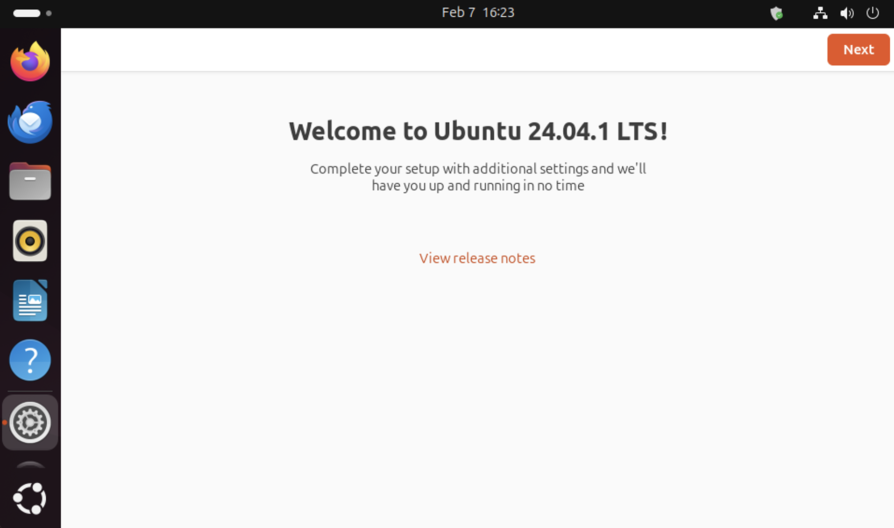

Launch an Ubuntu desktop on EC2
===============================

This is a how-to guide on how to launch an Ubuntu desktop as an EC2 instance.

It will go over launching the instance via the EC2 console, and via the AWS CLI. Lastly, it shows you how to connect to the instance using RDP.

.. Note::

    To ensure that you are selecting the latest Long Term Support (LTS) or Pro version, check the `Ubuntu release notes 
    <https://releases.ubuntu.com>`_ for any updates.

Launch the instance 
-------------------

There are two popular ways to launch an instance: using the EC2 console or using the AWS CLI to interact with the AWS API. Select the one you are most comfortable with.

Use the EC2 Console
~~~~~~~~~~~~~~~~~~~

#. On the EC2 console, launch an instance by selecting an Ubuntu AMI.

    .. image:: ./launch-ubuntu-desktop-on-ec2/2a_Launch_instance.png
        
#. The recommended hardware requirements to run an Ubuntu desktop is at least 2 CPU cores, 8GB of RAM, and 8GB of volume. However, if you intend to install additional applications, you need a higher volume size.

#. Configure your security group to allow SSH and RDP ports (22 and 3389 respectively).

    .. image:: ./launch-ubuntu-desktop-on-ec2/2b_Launch_instance.png

Use the AWS CLI
~~~~~~~~~~~~~~~

#. Retrieve the latest AMI ID for the EC2 instance using one of the following CLI commands:

    * Ubuntu LTS:

      .. code-block:: bash

        aws ssm get-parameters --names /aws/service/canonical/ubuntu/server/24.04/stable/current/arm64/hvm/ebs-gp3/ami-id

    * Ubuntu Pro:

      .. code-block:: bash

        aws ssm get-parameters --names /aws/service/canonical/ubuntu/pro-server/24.04/stable/current/arm64/hvm/ebs-gp3/ami-id

#. Launch the instance using the :doc:`AWS CLI<./launch-ubuntu-ec2-instance>`.

Install Ubuntu desktop and the snap store
-----------------------------------------

There are several popular ways to access the terminal of your server:

#. Using an SSH client like PuTTY if you are running Windows
#. The ``ssh`` command executed in the terminal of your Linux, Mac, or Windows device.
#. The AWS EC2 Instance Connect feature

    .. image:: ./launch-ubuntu-desktop-on-ec2/2c_Launch_instance.png

After logging into your server, execute the commands below to install the Ubuntu desktop packages.

.. code:: bash

    sudo apt-get update && sudo apt-get upgrade -y
    sudo apt-get install -y ubuntu-desktop
    sudo snap install snap-store --edge
    sudo reboot

.. Note::
    Don't disconnect the session after executing these commands. The installation process
    may take several minutes, and a disconnection could interrupt it.

Install and configure RDP
-------------------------

Install the xrdp server:

.. code:: bash
    
    sudo apt-get install -y xrdp

Configure it to use SSL to get an encrypted connection:

.. code:: bash

    sudo usermod -a -G ssl-cert xrdp

Set up a password for the Ubuntu user:

.. code:: bash

    sudo passwd ubuntu

Restart the service:

.. code:: bash

    sudo systemctl restart xrdp

Connect to your instance
------------------------

Connect to your instance using your favorite RDP client. You can get the public IP address of the instance from the EC2 console. The RDP connection port is 3389.

The default username for the EC2 instance is ``ubuntu``.

When prompted to input a password, use the password you configured for the user.

