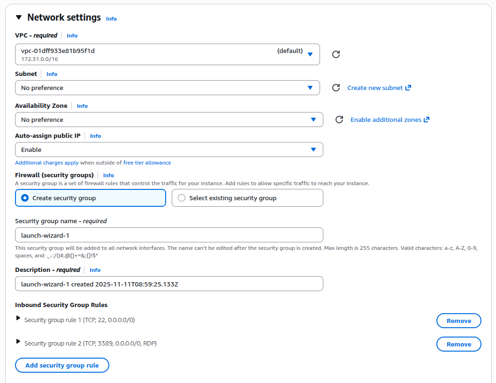

.. meta::
   :description: Learn how to launch an Ubuntu Desktop on AWS EC2. Includes steps for launching the instance, installing the desktop environment, configuring RDP, and connecting to the instance.  

.. _launch-ubuntu-desktop:

Launch an Ubuntu desktop on EC2
===============================

To launch an Ubuntu desktop on EC2, you'll first need to launch an Ubuntu instance and then install the Ubuntu desktop on it.

Launch an Ubuntu instance 
--------------------------

To launch an Ubuntu instance, you can either use the EC2 console or the AWS CLI. To ensure that you are selecting the latest Long Term Support (LTS) or Pro version, check the `Ubuntu release notes <https://releases.ubuntu.com>`_ for any updates.

Using the EC2 Console
~~~~~~~~~~~~~~~~~~~~~~

On the EC2 console, launch an instance by selecting an Ubuntu AMI.
        
The recommended hardware requirements to run an Ubuntu desktop is at least 2 CPU cores, 8GB of RAM and 8GB of volume. However, if you intend to install additional applications, you'll need a higher volume size.

Configure your security group to allow SSH and RDP ports (22 and 3389 respectively).

Using the AWS CLI
~~~~~~~~~~~~~~~~~~

Retrieve the latest AMI ID for an Ubuntu image using one of the following commands:

* Ubuntu LTS:

.. code-block:: bash

    aws ssm get-parameters --names /aws/service/canonical/ubuntu/server/26.04/stable/current/arm64/hvm/ebs-gp3/ami-id

* Ubuntu Pro:

.. code-block:: bash

    aws ssm get-parameters --names /aws/service/canonical/ubuntu/pro-server/26.04/stable/current/arm64/hvm/ebs-gp3/ami-id

Now launch the instance by referring to the instructions for :ref:`launching using the AWS CLI <launch-ubuntu-ec2-instance>`.

Install Ubuntu desktop 
-----------------------

Log in to your instance and install the Ubuntu desktop packages:

.. code:: bash

    sudo apt-get update && sudo apt-get upgrade -y
    sudo apt-get install -y ubuntu-desktop
    sudo reboot

.. Note::
    Don't disconnect the session after executing these commands. The installation process
    may take several minutes, and a disconnection could interrupt it.

Install and configure RDP
-------------------------

.. tab-set::

   .. tab-item:: Ubuntu 26.04 LTS and later
      :sync: ubuntu-26-04

      Set up a password for the Ubuntu user:

      .. code:: bash

          sudo passwd ubuntu

      ``gnome-remote-desktop`` is installed automatically as a dependency of ``ubuntu-desktop`` and provides built-in RDP support as a system service, so no separate RDP server needs to be installed.

      Create a directory for a TLS certificate and generate a self-signed one to encrypt the connection:

      .. code:: bash

          GRD_DIR=/var/lib/gnome-remote-desktop/.local/share/gnome-remote-desktop

          sudo -u gnome-remote-desktop mkdir -p "$GRD_DIR"
          sudo openssl req -new -newkey rsa:4096 -days 720 -nodes -x509 \
            -subj /CN=localhost \
            -out "$GRD_DIR/tls.crt" -keyout "$GRD_DIR/tls.key"
          sudo chown -R gnome-remote-desktop: /var/lib/gnome-remote-desktop/.local
          sudo chmod 600 "$GRD_DIR/tls.key"

      Configure the RDP server with the certificate and a set of credentials, then enable it:

      .. code:: bash

          GRD_DIR=/var/lib/gnome-remote-desktop/.local/share/gnome-remote-desktop

          sudo grdctl --system rdp set-tls-key  "$GRD_DIR/tls.key"
          sudo grdctl --system rdp set-tls-cert "$GRD_DIR/tls.crt"
          sudo grdctl --system rdp set-auth-methods credentials

      .. note::
          ``set-auth-methods`` requires at least one authentication method to be set. ``credentials`` is the default on a fresh install, but setting it explicitly makes the configuration clearer.

      Set the credentials used to authenticate RDP connections. Run this command on its own, since it prompts interactively for a username and password:

      .. code:: bash

          sudo grdctl --system rdp set-credentials

      .. warning::
          Don't run this command as part of a larger pasted block. It's the only interactive command in this procedure: if it's pasted together with other commands, the terminal feeds those following lines into the username and password prompts instead of running them, and neither the credentials nor the following commands end up correct. Also never pass the username or password as command-line arguments, since that would record the password in your shell history.

      Once credentials are set, enable the RDP server and start the service:

      .. code:: bash

          sudo grdctl --system rdp enable
          sudo systemctl enable --now gnome-remote-desktop.service

      .. note::
          On EC2 instances, ``grdctl`` prints ``Init TPM credentials failed because No TPM device found, using GKeyFile as fallback`` on every invocation. This is expected, since EC2 instances have no TPM, and is harmless.

      Check that the service is running and listening on the RDP port:

      .. code:: bash

          sudo grdctl --system status
          sudo ss -lntp | grep 3389

   .. tab-item:: Ubuntu 24.04 LTS
      :sync: ubuntu-24-04

      .. warning::
          This procedure only applies to Ubuntu 24.04 LTS. It doesn't work on Ubuntu 26.04 LTS and later, because GNOME Shell only supports Wayland sessions on those releases. If you're running 26.04 or later, switch to the :guilabel:`Ubuntu 26.04 LTS and later` tab instead.

      Install the xrdp server:

      .. code:: bash

          sudo apt-get install -y xrdp

      Configure it to use SSL to get an encrypted connection:

      .. code:: bash

          sudo usermod -a -G ssl-cert xrdp

      Set up a password for the Ubuntu user:

      .. code:: bash

          sudo passwd ubuntu

      Restart the service:

      .. code:: bash

          sudo systemctl restart xrdp

      Next, configure the Ubuntu session used by the xrdp wrapper. Using Nano or your favorite text editor, create the following file:

      .. code:: bash

          sudo nano /usr/local/bin/ubuntu-session

      Insert the following content:

      .. code:: bash

          #!/bin/sh

          export GNOME_SHELL_SESSION_MODE=ubuntu
          export DESKTOP_SESSION=ubuntu-xorg
          export XDG_SESSION_DESKTOP=ubuntu-xorg
          export XDG_CURRENT_DESKTOP=ubuntu:GNOME

          exec /usr/bin/gnome-session --session=ubuntu

      Make the script executable:

      .. code:: bash

          sudo chmod +x /usr/local/bin/ubuntu-session

      Finally, update the session manager to use the new session configuration:

      .. code:: bash

          sudo update-alternatives --install /usr/bin/x-session-manager x-session-manager /usr/local/bin/ubuntu-session 60

Connect to your instance
------------------------

.. tab-set::

   .. tab-item:: Ubuntu 26.04 LTS and later
      :sync: ubuntu-26-04

      Connect to your instance using any RDP client, such as Remmina. You can get the public IP address of the instance from the EC2 console and the RDP connection port is 3389.

      Since the connection uses a self-signed certificate, your RDP client will show a warning on the first connection; this is expected.

      Connecting requires two rounds of authentication:

      1. First, authenticate with the RDP credentials you set with ``grdctl --system rdp set-credentials`` to reach the GDM login screen.
      2. Then, log in at the GDM screen with a real Linux user account, such as ``ubuntu``, using the password you set earlier.

      This differs from xrdp, which only prompts once.

      Once connected, GNOME shows a remote desktop indicator in the top bar with a stop control that ends the session when selected.

   .. tab-item:: Ubuntu 24.04 LTS
      :sync: ubuntu-24-04

      Connect to your instance using any RDP client, such as Remmina. You can get the public IP address of the instance from the EC2 console and the RDP connection port is 3389.

      The default username for the EC2 instance is ``ubuntu``.

      When prompted to input a password, use the password you configured for the user.
