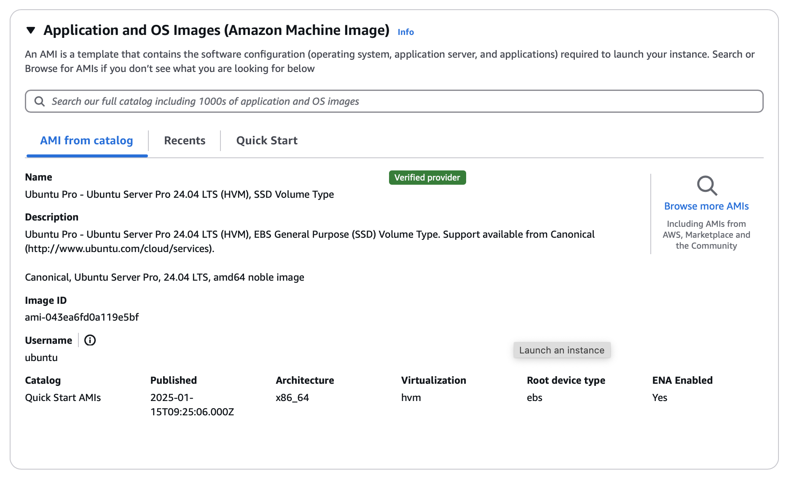

Launch an Ubuntu desktop on EC2
===============================

To launch an Ubuntu desktop on EC2, you'll first need to launch an Ubuntu instance and then install the Ubuntu desktop on it.

Launch an Ubuntu instance 
--------------------------

To launch an Ubuntu instance, you can either use the EC2 console or the AWS CLI. To ensure that you are selecting the latest Long Term Support (LTS) or Pro version, check the `Ubuntu release notes <https://releases.ubuntu.com>`_ for any updates.

Using the EC2 Console
~~~~~~~~~~~~~~~~~~~~~~

On the EC2 console, launch an instance by selecting an Ubuntu AMI.
        
The recommended hardware requirements to run an Ubuntu desktop is at least 2 CPU cores, 8GB of RAM and 8GB of volume. However, if you intend to install additional applications, you'll need a higher volume size.

Configure your security group to allow SSH and RDP ports (22 and 3389 respectively).

Using the AWS CLI
~~~~~~~~~~~~~~~~~~

Retrieve the latest AMI ID for an Ubuntu image using one of the following commands:

* Ubuntu LTS:

.. code-block:: bash

    aws ssm get-parameters --names /aws/service/canonical/ubuntu/server/24.04/stable/current/arm64/hvm/ebs-gp3/ami-id

* Ubuntu Pro:

.. code-block:: bash

    aws ssm get-parameters --names /aws/service/canonical/ubuntu/pro-server/24.04/stable/current/arm64/hvm/ebs-gp3/ami-id

Now launch the instance by referring to the instructions for :doc:`launching using the AWS CLI<./launch-ubuntu-ec2-instance>`.

Install Ubuntu desktop 
-----------------------

Log in to your instance and install the Ubuntu desktop packages:

.. code:: bash

    sudo apt-get update && sudo apt-get upgrade -y
    sudo apt-get install -y ubuntu-desktop
    sudo reboot

.. Note::
    Don't disconnect the session after executing these commands. The installation process
    may take several minutes, and a disconnection could interrupt it.

Install and configure RDP
-------------------------

Install the xrdp server:

.. code:: bash
    
    sudo apt-get install -y xrdp

Configure it to use SSL to get an encrypted connection:

.. code:: bash

    sudo usermod -a -G ssl-cert xrdp

Set up a password for the Ubuntu user:

.. code:: bash

    sudo passwd ubuntu

Restart the service:

.. code:: bash

    sudo systemctl restart xrdp

Connect to your instance
------------------------

Connect to your instance using any RDP client, such as Remmina. You can get the public IP address of the instance from the EC2 console and the RDP connection port is 3389.

The default username for the EC2 instance is ``ubuntu``.

When prompted to input a password, use the password you configured for the user.
