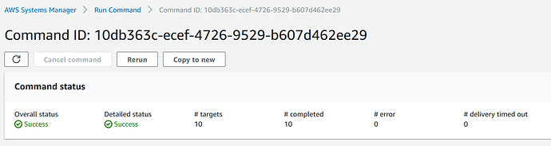

Upgrade to Ubuntu Pro at scale using tokens with SSM
====================================================

Overview
--------

Ubuntu Pro extends Ubuntu LTS’ standard 5 years of security maintenance to 10 years, with an additional 5 years available through the Legacy add-on. It also expands security coverage beyond the main repository to more than 25,000 packages in the Universe repository.

There are three ways to get Ubuntu Pro on AWS:

1. Launch an Ubuntu Pro instance from the AWS Marketplace, ready to use with a pay-as-you-go pricing model.
2. Upgrade an existing instance to Ubuntu Pro using AWS License Manager.
3. Attach an Ubuntu Pro token to any running Ubuntu LTS instance.

This how-to covers the third option: activating Ubuntu Pro via token using AWS Systems Manager (SSM).

Prerequisites
-------------

- An Ubuntu One account with your Ubuntu Pro token(s). You can create one for free on the `Ubuntu Pro portal <https://ubuntu.com/pro>`_.
- Ubuntu machines with the SSM Agent installed (available by default on Ubuntu 16.04 and later). If the instances have the right IAM role for SSM access, the servers will appear as Managed Nodes in AWS Systems Manager Fleet Manager (see the reference links for more information).
- A basic understanding of `how to write and run SSM Documents <https://docs.aws.amazon.com/systems-manager/latest/userguide/documents-creating-content.html>`_

Create an SSM Document to attach the token
--------------------------------------------

.. admonition:: What is an SSM document?

    An AWS Systems Manager document (SSM document) defines the actions that Systems Manager performs on your managed instances.

The SSM document is a JSON or YAML file that contains the steps or actions to be executed on an instance. In this case, we will 
run the commands required to attach a token and apply Ubuntu Pro updates, if available.

.. note::
    
   Because tokens are fungible, it is not recommended to hard-code them in the document. Instead, pass the token as a user-defined parameter.

Below is the full SSM document definition:

.. code-block::

    ---
    schemaVersion: '2.2'
    description: "Enable Pro services using a Pro token"
    parameters:
      token:
        type: String
    mainSteps:
    - action: aws:runShellScript
      name: update
      inputs:
        runCommand:
        - "sudo apt-get update && sudo apt-get upgrade -y"
    - action: aws:runShellScript
      name: attachToken
      inputs:
        runCommand:
        - "sudo pro attach {{ token }}"
    - action: aws:runShellScript
      name: updateWithESM
      inputs:
        runCommand:
        - "sudo apt-get update && sudo apt-get upgrade -y"

The token will be requested from the user when the document is executed. The document performs the following steps:

1. Runs an update to ensure the Pro client is up to date.
2. Attaches the Ubuntu Pro token.
3. Runs another update in case installed software can now receive security updates from Ubuntu Pro repositories.

No reboot is required unless updates affect core components such as the kernel.

Run the SSM script
------------------

The SSM document can be executed either from Fleet Manager or using SSM Run Command. More information is available in `this tutorial <https://ubuntu.com/tutorials/how-to-create-ssm-documents-and-use-them-to-install-packages-massively-with-run-command#1-overview>`_.

You do not need to restart your machines after attaching the token. If the SSM execution fails, check the document format for errors or typos and try again. If the issue persists, review the command output in SSM for configuration problems, for example, whether the instances have network access to package repositories. Ubuntu Pro repositories are hosted on dedicated endpoints, which may require `additional network configuration <https://documentation.ubuntu.com/pro-client/en/latest/references/network_requirements/>`_.

Check the Pro status of your machine
------------------------------------

You can verify the subscription status at any time by running: 

.. code-block::
    
    sudo pro status 

This command displays your entitlements and the services that are enabled.

Additional resources and links
------------------------------

- `Getting started with Ubuntu Pro <https://ubuntu.com/engage/aws-pro-onboarding>`_
- `Running scripts at scale on SSM with Run Command and SSM Documents <https://ubuntu.com/tutorials/how-to-create-ssm-documents-and-use-them-to-install-packages-massively-with-run-command#1-overview>`_
- `Enabling SSM and using SSM Session Manager on Ubuntu <https://ubuntu.com/tutorials/how-to-use-aws-ssm-session-manager-for-accessing-ubuntu-pro-instances#1-overview>`_
- `AWS Systems Manager documentation (AWS) <https://docs.aws.amazon.com/systems-manager/>`_
- `Creating SSM Documents (AWS) <https://docs.aws.amazon.com/systems-manager/latest/userguide/documents-creating-content.html>`_
- `Ubuntu Pro on AWS <https://ubuntu.com/aws/pro>`_
- `Network requirements for Pro ESM repositories <https://documentation.ubuntu.com/pro-client/en/latest/references/network_requirements/>`_

