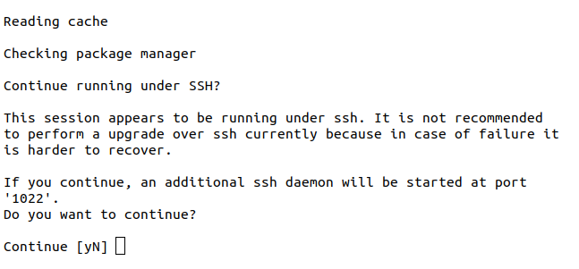
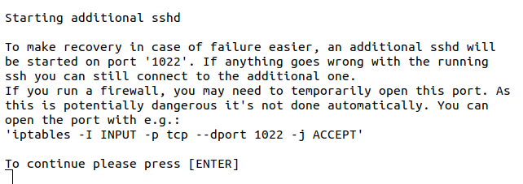
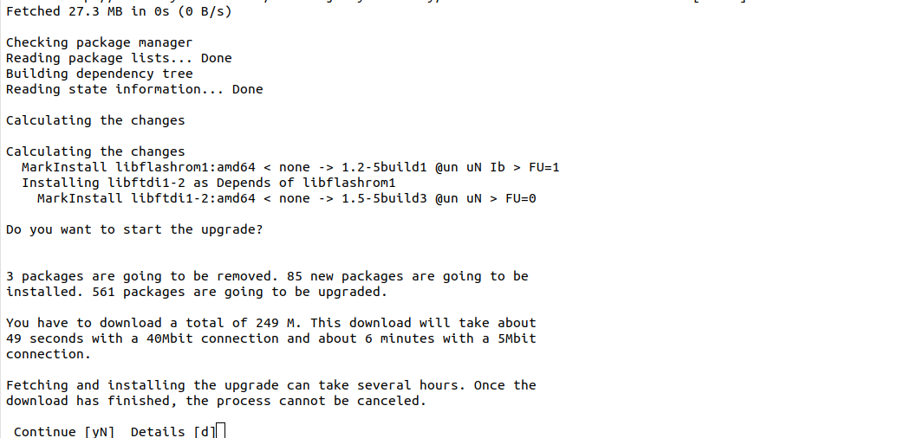
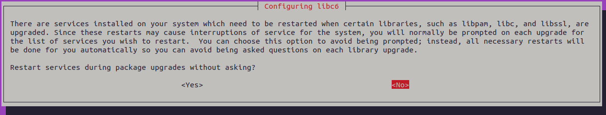
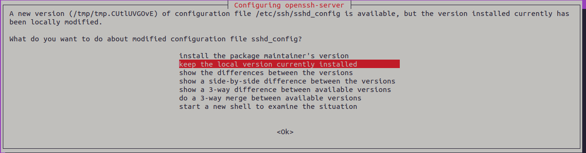
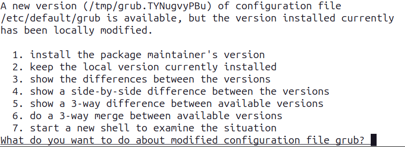
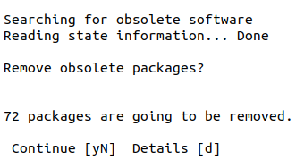
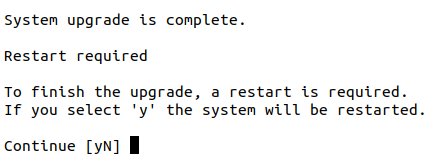

Upgrade Ubuntu LTS release on EC2
==================================

General Advice
---------------

Once you have decided to upgrade your system, the next question is how? There are two options depending on whether your system is setup/deployed with automation or whether it requires manual configuration.

For fully automated system deployments it is recommended to redeploy with new instances instead of upgrading from older releases.

For systems that cannot be easily created or destroyed and require manual configuration, running `do-release-upgrade <https://manpages.ubuntu.com/manpages/noble/en/man8/do-release-upgrade.8.html>`_ is a good option. However this option requires some :ref:`manual intervention <manual intervention ec2>` as explained below. 

.. _manual intervention ec2:

Manual intervention steps
-------------------------

While upgrading releases, manual decision making will be needed for the following options that are presented.

Additional SSH daemon
~~~~~~~~~~~~~~~~~~~~~

When upgrading in a session over SSH there is an inherent risk of losing access if something goes wrong with the SSH daemon. To mitigate this risk an additional SSH daemon is started on a different port as a backup.

The prompt notifies you that an additional SSH daemon will be started and you can either continue or cancel the upgrade.

Optional firewall rules for additional SSH daemon
~~~~~~~~~~~~~~~~~~~~~~~~~~~~~~~~~~~~~~~~~~~~~~~~~

If you are using a firewall there is a chance that the port used by the backup SSHD is not open. Opening this port is not done automatically since it could be security risk. An optional command to open the port is provided and you are prompted to press enter to continue.

Start upgrade
~~~~~~~~~~~~~
A final prompt is provided before starting the upgrade. It gives information about the number of changes and the estimated time to complete because once started, the upgrade process cannot be canceled. At this stage you can continue, cancel or see additional details.

Restart services automatically (may occur)
~~~~~~~~~~~~~~~~~~~~~~~~~~~~~~~~~~~~~~~~~~

During the upgrade of certain libraries, some services have to be restarted. You have the option of allowing the services to be restarted automatically during the upgrade. If you select 'no' here, you'll be asked about the services that you want to restart after each library upgrade. 

SSHD configuration modified (may occur)
~~~~~~~~~~~~~~~~~~~~~~~~~~~~~~~~~~~~~~~

Canonical makes changes to ``/etc/ssh/sshd_config`` for AWS EC2 images. As a result, during the upgrade you may see a prompt notifying you about the availability of a newer version of the sshd_config file. You'll be asked if you want to keep the existing modified version, use the default one from the new upgrade or take some other action.

Grub configuration modified (may occur)
~~~~~~~~~~~~~~~~~~~~~~~~~~~~~~~~~~~~~~~

During the upgrade you may see a prompt notifying you about the availability of a newer version of the ``/etc/default/grub`` file. You'll be asked if you want to keep the existing modified version, use the default one from the new upgrade or take some other action.

Remove obsolete packages
~~~~~~~~~~~~~~~~~~~~~~~~

An obsolete package is a package which is no longer available in any of the sources for apt. Usually it is safe and recommended to remove obsolete packages. But before doing so you'll be asked if you wish to remove them and you'll have the option to select from yes, no and more details.

Restart to finish upgrade
~~~~~~~~~~~~~~~~~~~~~~~~~

Finally, a restart will be necessary for some parts of the upgrade to be applied. If you select no, you can use ``/var/run/reboot-required.pkgs`` to check for the packages that need a reboot.

