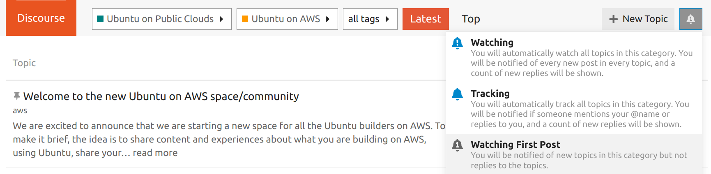

Ubuntu on AWS Announcements
===========================

The official channel for Ubuntu on AWS announcements is 
on the `Ubuntu discourse <https://discourse.ubuntu.com/>`_. 
To monitor for release notes, new products, upcoming features, and community polls
you can subscribe to the `Ubuntu on AWS <https://discourse.ubuntu.com/c/project/aws/177>`_
category.

To sign up for notifications you will need to create an 
`Ubuntu One <https://login.ubuntu.com/>`_ account. Once you have
created one you can configure notifications for the category by 
clicking on the bell at the top right of the screen. We recommend
"Watching First Post" to receive notifications on new topics.

