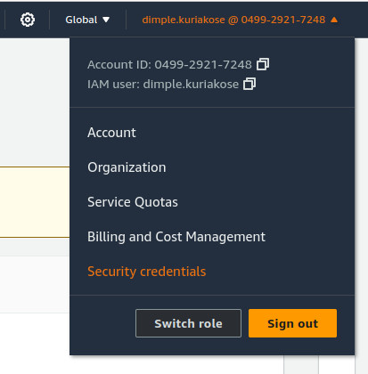

EC2 credentials
===============

There are different kinds of EC2 credentials and Amazon uses slightly non-standard nomenclature. A basic overview is given here. For a more detailed discussion refer to the AWS documentation on `security credentials`_.

Sign-in credentials
-------------------

This is the email address/password pair that you use when you sign up for `Amazon Web Services`_. You use these to sign in to the `AWS EC2 console`_. They can be considered as the "account owner/root" credentials as they allow you to create or regenerate all other types of credentials.

Access credentials
------------------

There are three types of credentials that can be used to access different AWS resources. *Access keys* and *X.509 certificates* allow you to connect to Amazon APIs. Which one of them to choose depends on the API and the tool that you are using. Some APIs and tools support both options, while others support just one. The third type of access credential is SSH public/private *key pairs* that are used for initial logins to newly created instances.

Access keys
~~~~~~~~~~~

These keys use symmetric key encryption. They are used for making requests to AWS product REST or query APIs. They can be obtained/regenerated from the :guilabel:`Access keys` tab on the *Security credentials* page (accessible from a logged in user's drop-down menu as shown below):

X.509 certificates
~~~~~~~~~~~~~~~~~~

These certificates use public key encryption. They can be used to make secure SOAP protocol requests to AWS service APIs. They are the credentials used when using the command-line EC2 API tools.

X.509 certificates can be obtained/regenerated from the :guilabel:`X.509 Signing certificates` tab on the *Security credentials* page.

Key pairs
~~~~~~~~~
These are SSH key pairs. When you create an instance, Amazon inserts the public key of your SSH key pair into your new instance so that you can log in using your private key. You can add new SSH key pairs through the AWS management console by searching for *Key Pairs*. It should be under *Network & Security* in the navigation pane. Select :guilabel:`Create key pair` and after specifying a name you'll be prompted to download and save your private key. For a more detailed explanation, refer to the AWS documentation for `creating key pairs`_

EC2 stores the public portion of your key pair, and inserts it into ``/home/ubuntu/.ssh/authorized_keys`` when you instantiate your instance. If you lose your private key, it cannot be downloaded again. You'll need to generate a new key pair.

.. _`security credentials`: https://docs.aws.amazon.com/IAM/latest/UserGuide/security-creds.html
.. _`Amazon Web Services`: https://aws.amazon.com
.. _`AWS EC2 Console`: https://console.aws.amazon.com/ec2/home
.. _`creating key pairs`: https://docs.aws.amazon.com/AWSEC2/latest/UserGuide/create-key-pairs.html
