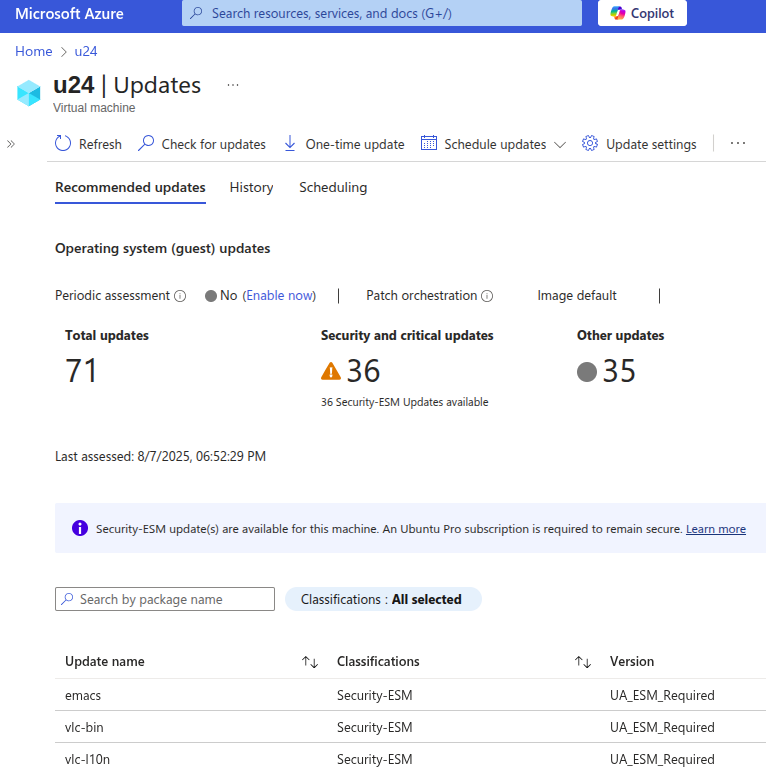
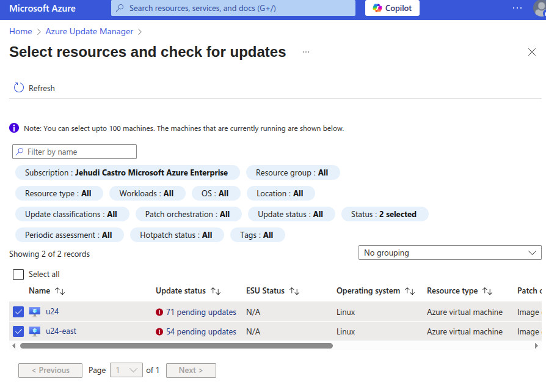

Check for available security updates using Azure Update Manager
================================================================

`Azure's Update Manager`_ shows missing Ubuntu Pro updates for all Ubuntu LTS releases. To check for available updates, log on to the Azure portal and open Azure Update Manager. 

Check updates for a specific VM
-------------------------------

To check the security assessment for a specific VM, navigate to the VM and select "Updates". You should see something like:

It shows the specific packages with known vulnerabilities that can be patched with an Ubuntu Pro subscription.

Check updates for multiple VMs
------------------------------

To get a unified dashboard view for your entire fleet, you can you can select multiple VMs and initiate assessments simultaneously. You should see something like:

It identifies all the instances that would gain from Ubuntu Pro's expanded coverage, along with the number of updates available for each.

.. _`Azure's Update Manager`: https://learn.microsoft.com/en-us/azure/update-manager/overview
