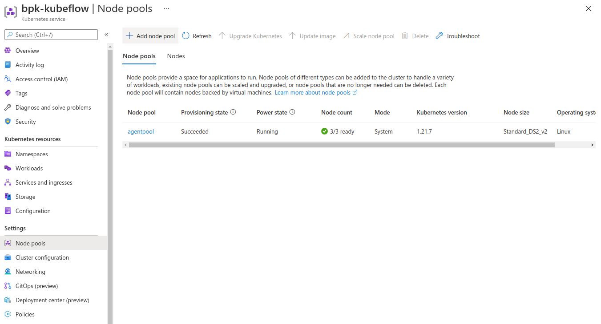
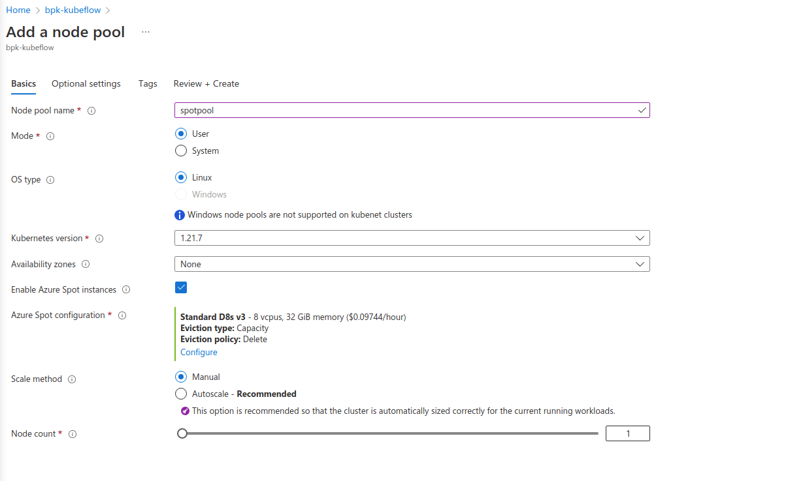

Deploy Kubeflow pipelines with AKS spot instances
=================================================

`Charmed Kubeflow`_ is an MLOps platform that delivers an end-to-end solution for AI/ML applications. It includes Kubeflow Pipelines, an engine for orchestrating different MLOps workflows.

Kubeflow pipelines can be created using `Azure spot instances`_ on an AKS cluster. This can save costs as long as appropriate tasks are chosen for the spot instances and their eviction is handled gracefully.

.. hlist::
   :columns: 2

   * **Use spot instances for :**
   * --- data processing
   * --- distributed training & hyperparameter tuning
   * --- model training (with checkpointing)
   * --- batch inference
   * **Don't use spot instances for :**
   * --- Kubernetes control plane
   * --- notebooks and dashboards
   * --- datastores or databases
   * --- a model serving as an online inference

To create Kubeflow pipelines with spot instances, start with an AKS cluster containing an existing deployment of Charmed Kubeflow. Refer to `Install Kubeflow on AKS`_ for  instructions.

Add spot instances
------------------

In the cluster details screen of your Kubeflow deployment on AKS, go to :guilabel:`Settings` > :guilabel:`Node pools` > :guilabel:`Add node pool`:

Select :guilabel:`Enable Azure Spot instances`:

Specify when and how your node should be evicted - :guilabel:`Eviction type` and :guilabel:`Eviction policy`. If you have a maximum price over which it is not worth running your workload, then specify that:

Create the pool after specifying all required fields. Once the VMs are up, check if all the nodes are available in the portal's :guilabel:`Node pools` tab or on the command line using ``kubectl get nodes``.

Update pipeline to allow task execution on spot instances
---------------------------------------------------------

To enable tasks to execute on spot instances, use the Kubernetes `toleration` mechanism. Add an appropriate toleration to each task and if the tasks have to run on a certain type of node (say GPU required), include an `affinity` configuration to enforce the type of pods allowed.

Sample code
~~~~~~~~~~~

To try out the changes needed, you can clone this `Kubeflow-examples`_ repository and use the notebooks from the ``aks-spot-instances`` folder to create new notebooks in your Kubeflow deployment. Run the first notebook (01-base-workload) and use the Kubeflow Pipelines UI to see the workflow run details:

To check where the workflow steps were executed run ``kubectl get pods -n admin -o wide`` and in the `NODE` column, you'll see that all the tasks were executed on ``agentpool``:

The code used to create the pipeline was:

.. code::

   @dsl.pipeline(
    name="base_pipeline",
    description="my base pipeline",
   )
   def my_pipeline(url):
      web_downloader_task = web_downloader_op(url=url)
      merge_csv_task = create_step_merge_csv(file=web_downloader_task.outputs['data'])
   
   client = kfp.Client()
   
   client.create_run_from_pipeline_func(
      my_pipeline,
      arguments={
         'url': 'https://storage.googleapis.com/ml-pipeline-playground/iris-csv-files.tar.gz'
      })

Now, run the second notebook (02-spot-workload) to use spot instances. The pipeline definition in this code includes `toleration` and `affinity`. This configuration is done at the pipeline level and is applicable to each task, but the tasks themselves are unaware of it.

.. code::

   from kubernetes.client.models import V1Toleration, V1Affinity, V1NodeAffinity, V1NodeSelector, V1NodeSelectorTerm, V1NodeSelectorRequirement

   @dsl.pipeline(
      name="base_pipeline",
      description="my base pipeline",
   )
   def my_pipeline(url):
      web_downloader_task = web_downloader_op(url=url)
      merge_csv_task = create_step_merge_csv(file=web_downloader_task.outputs['data'])

      toleration = V1Toleration(
         key="kubernetes.azure.com/scalesetpriority",
         operator="Equal",
         value="spot",
         effect="NoSchedule",
      )
      web_downloader_task.add_toleration(toleration)
      merge_csv_task.add_toleration(toleration)

      aff = V1Affinity(node_affinity=V1NodeAffinity(
         required_during_scheduling_ignored_during_execution=V1NodeSelector(
               node_selector_terms=[V1NodeSelectorTerm(
                  match_expressions=[V1NodeSelectorRequirement(
                     key='kubernetes.azure.com/scalesetpriority',
                     operator='In',
                     values=['spot'])])]))
      )
      web_downloader_task.add_affinity(aff)
      merge_csv_task.add_affinity(aff)
   
   client = kfp.Client()
   
   client.create_run_from_pipeline_func(
      my_pipeline,
      arguments={
         'url': 'https://storage.googleapis.com/ml-pipeline-playground/iris-csv-files.tar.gz'
      })

The results seen will be the same as before except for the node names. Run ``kubectl get pods -n admin -o wide | grep "spot-pipeline"`` to see that the tasks were executed on the ``spotpool``.

Handle eviction gracefully
--------------------------

To handle spot eviction gracefully, set the `retry` policy for all tasks that are to be executed on a spot instance. This ensures that when the task fails, the pipeline will retry the task after waiting for a while (``backoff_duration``). It'll keep doing this until a specified count of maximum retries (``num_retries``) is reached. 

You can use the third notebook (03-spot-retries-workload) to try this out. Here the backoff duration is set to 5 minutes to give enough time for a new node to spawn and the max retry count is set to 5:

.. code::

   from kubernetes.client.models import V1Toleration, V1Affinity, V1NodeAffinity, V1NodeSelector, V1NodeSelectorTerm, V1NodeSelectorRequirement

   @dsl.pipeline(
      name="base_pipeline",
      description="my base pipeline",
   )
   def my_pipeline(url):
      web_downloader_task = web_downloader_op(url=url)
      merge_csv_task = create_step_merge_csv(file=web_downloader_task.outputs['data'])

      toleration = V1Toleration(
         key="kubernetes.azure.com/scalesetpriority",
         operator="Equal",
         value="spot",
         effect="NoSchedule",
      )
      web_downloader_task.add_toleration(toleration)
      merge_csv_task.add_toleration(toleration)

      aff = V1Affinity(node_affinity=V1NodeAffinity(
         required_during_scheduling_ignored_during_execution=V1NodeSelector(
               node_selector_terms=[V1NodeSelectorTerm(
                  match_expressions=[V1NodeSelectorRequirement(
                     key='kubernetes.azure.com/scalesetpriority',
                     operator='In',
                     values=['spot'])])]))
      )
      web_downloader_task.add_affinity(aff)
      merge_csv_task.add_affinity(aff)
      
      web_downloader_task.set_retry(num_retries=5, backoff_dureation="5m")
      merge_csv_task.set_retry(num_retries=5, backoff_dureation="5m")

   client = kfp.Client()

   client.create_run_from_pipeline_func(
      my_pipeline,
      arguments={
         'url': 'https://storage.googleapis.com/ml-pipeline-playground/iris-csv-files.tar.gz'
      })

.. _`Charmed Kubeflow`: https://canonical.com/mlops/kubeflow
.. _`Azure spot instances`: https://azure.microsoft.com/en-gb/products/virtual-machines/spot/
.. _`Kubeflow-examples`: https://github.com/Barteus/kubeflow-examples
.. _`Install Kubeflow on AKS`: https://charmed-kubeflow.io/docs/install-on-aks

