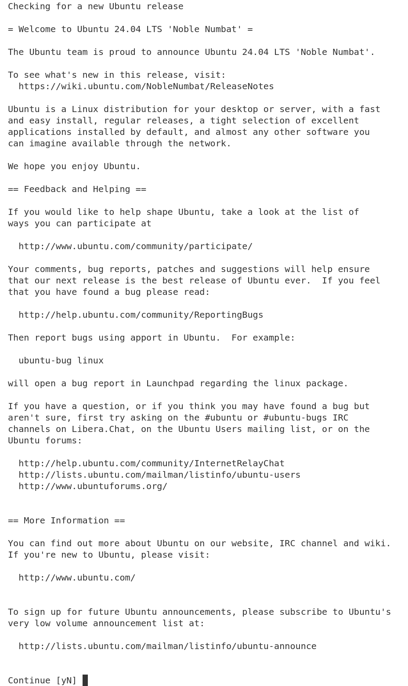
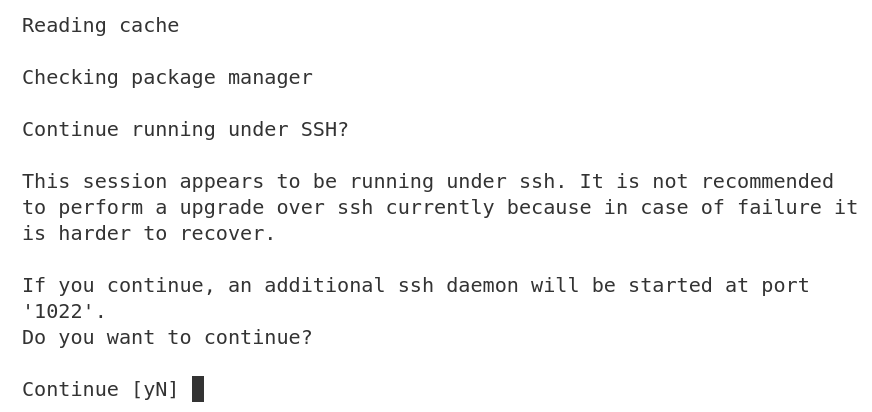
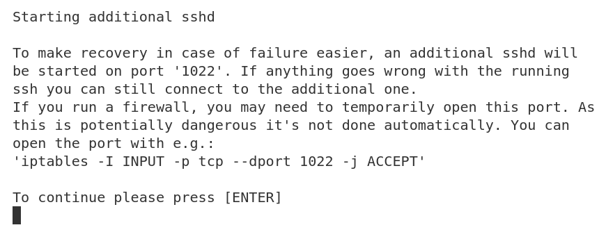
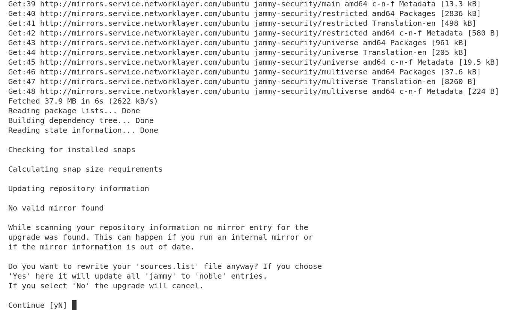
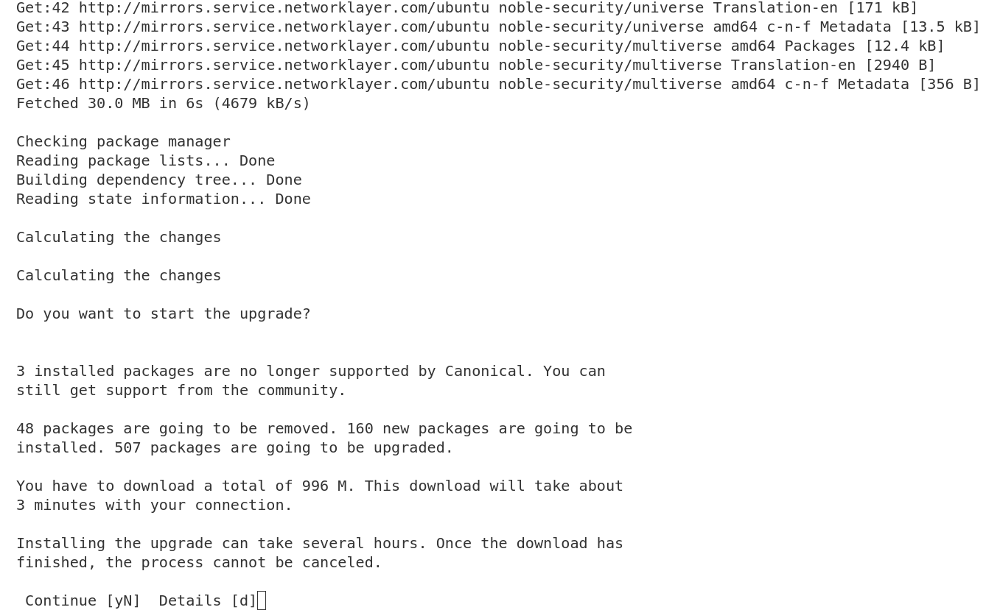
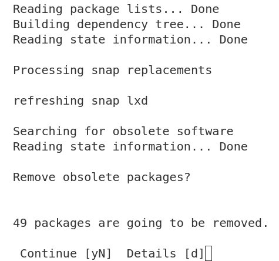
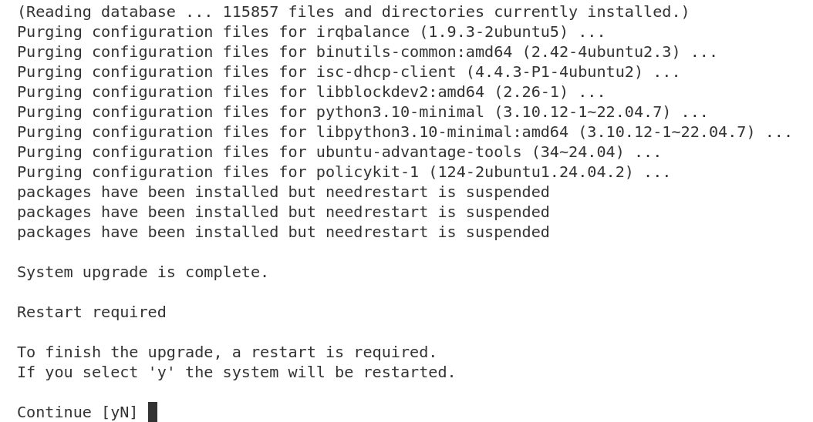
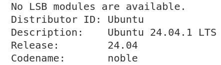

Upgrade from Jammy to Noble on IBM Cloud
========================================

Introduction
------------

This how-to guide explains how to upgrade from Jammy (Ubuntu 22.04) to Noble (Ubuntu 24.04) on both IBM VPC and IBM
Classic using the `do-release-upgrade` command. Despite many differences between the two, the upgrade process is
identical for both IBM VPC and IBM Classic.

General Advice
---------------

Once you have decided to upgrade your system, the next question is how? There are two options depending on whether your system is setup/deployed with automation or whether it requires manual configuration.

For fully automated system deployments it is recommended to redeploy with new Noble instances instead of upgrading from Jammy.

For systems that cannot be easily created or destroyed and require manual configuration, running `do-release-upgrade
<https://manpages.ubuntu.com/manpages/jammy/man8/do-release-upgrade.8.html>`_ is a good option. However this option
requires some :ref:`manual intervention <manual intervention ibm noble>` as explained below. 

.. _manual intervention ibm noble:

Getting started
---------------

Run the following command to start the upgrade process:

.. code-block::

   sudo do-release-upgrade

Manual intervention steps
-------------------------

While upgrading from Jammy to Noble, manual decision making will be needed for the following options that are presented.

Initial continue prompt
~~~~~~~~~~~~~~~~~~~~~~~

When you run the upgrade command, you'll be prompted to continue. This is the first step in the upgrade process. You can
either continue or cancel the upgrade.

Type ``y`` and press Enter to continue.

Additional SSH daemon
~~~~~~~~~~~~~~~~~~~~~

When upgrading in a session over SSH there is an inherent risk of losing access if something goes wrong with the SSH daemon. To mitigate this risk an additional SSH daemon is started on a different port as a backup.

The prompt notifies you that an additional SSH daemon will be started and you can either continue or cancel the upgrade.

Type ``y`` and press Enter to continue.

Optional firewall configuration
~~~~~~~~~~~~~~~~~~~~~~~~~~~~~~~

The new SSH daemon will be started on a different port (1022) and you'll be asked if you want to update the firewall
configuration to allow connections on this port. At this point, if you need to make changes, open a new terminal and
ssh back into the instance (on port 22) and update the firewall configuration to allow connections on port 1022.
If you need to make changes, follow the iptables instructions provided in the prompt.

Once you have made the changes, or are certain that you do not need to make any changes, type ``y`` and press Enter to
continue.

Update sources.list
~~~~~~~~~~~~~~~~~~~

Since the IBM Classic Jammy image is configured to use internal mirrors by default, the ``sources.list`` entries will
likely need to be updated from 'jammy' to 'noble'. 

Type ``y`` and press enter to automatically update the ``sources.list`` entries.

Start upgrade
~~~~~~~~~~~~~

A final prompt is provided before starting the upgrade. It gives information about the number of changes and the estimated time to complete because once started, the upgrade process cannot be canceled. At this stage you can continue, cancel or see additional details.

Auto-remove obsolete packages
~~~~~~~~~~~~~~~~~~~~~~~~~~~~~

After the upgrade is complete, you'll be asked if you want to remove obsolete packages. This is a good practice to keep
your system clean and free of unnecessary packages. 

Type ``y`` and press Enter to automatically remove obsolete packages.

Restart to finish upgrade
~~~~~~~~~~~~~~~~~~~~~~~~~

Finally, a restart will be necessary for some parts of the upgrade to be applied. If you select no, you can use ``/var/run/reboot-required.pkgs`` to check for the packages that need a reboot.

Re-connect and confirm upgrade
~~~~~~~~~~~~~~~~~~~~~~~~~~~~~~~

After the upgrade is complete, you'll be disconnected from the instance. Reconnect to the instance and confirm that the
upgrade was successful. 

Type ``lsb_release -a`` to check the release version. The output should show '24.04' as the release and 'Noble' as the
codename.

Celebrate
~~~~~~~~~

Congratulations! You have successfully upgraded your IBM Classic instance from Jammy to Noble. 🎉

Enjoy your instance running the latest Ubuntu LTS release with all the new features, improvements, and security updates.
