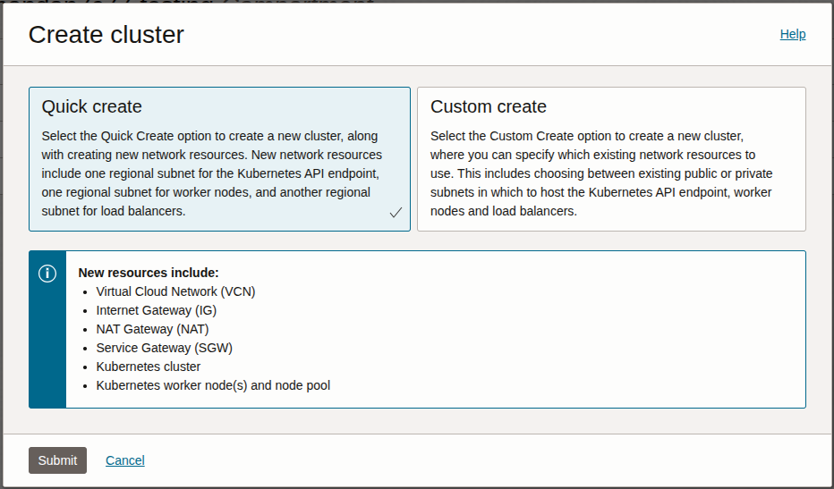
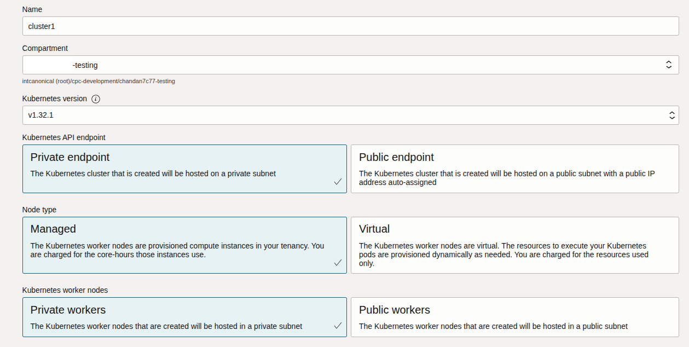
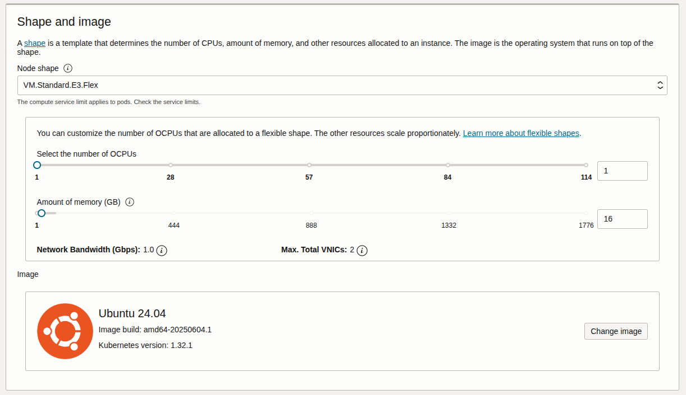
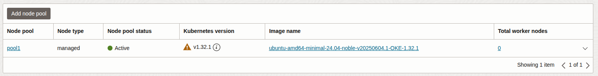
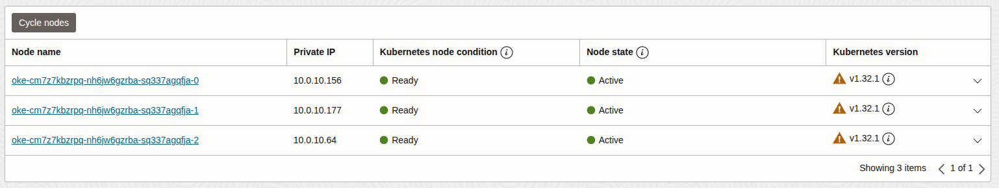

Deploy Ubuntu OKE nodes using Oracle Cloud Console
==================================================

.. Introduction to Ubuntu OKE node

Ubuntu images are available for OKE worker nodes, with support for a select number of suites and Kubernetes versions. For a list of supported OKE configurations, see our :doc:`Ubuntu availability on OKE </oracle-reference/ubuntu-availability-on-oke>` page.

Prerequisites
-------------

You'll need:

- Oracle Cloud compartment to create the nodes.
- `Domain`_, `Dynamic Group and Policy`_ configured (for self-managed nodes only).

.. include:: ../../reuse/OKE-nodes.txt
   :start-after: Start: Get Ubuntu image access
   :end-before: End: Get Ubuntu image access

After access is enabled, Ubuntu OKE images will be available for selection when creating a cluster or adding a node pool. You can choose your preferred Ubuntu image during the setup process.

Create an OKE cluster using Oracle Cloud Console
-------------------------------------------------

To create an OKE cluster from the Oracle Cloud Console:

In the Oracle Cloud Console, search for **Kubernetes Clusters (OKE)**, and then select :guilabel:`Create cluster`. You'll see two options:

- **Quick create**: Creates a new cluster and all required network resources automatically (VCN, gateways, subnets, node pool, etc.). It is recommended for new environments.
- **Custom create**: Lets you use existing network resources and allows you to customize the setup. Choose this if you need to integrate with existing VCNs or have specific network requirements.

On selecting **Quick create** which is used in this example, you'll be prompted to enter the cluster details:

- **Name**: the display name for your cluster
- **Compartment**: the compartment where the cluster and resources will be created
- **Kubernetes version**: the version of Kubernetes to deploy
- **Kubernetes API endpoint**: choose public or private endpoint access for the Kubernetes API server
- **Node type**: select managed or self-managed nodes.
- **Kubernetes worker nodes**: choose whether to create public or private worker nodes

- **Shape and image**: select the compute shape (OCPUs, memory) for your nodes. Then, to use Ubuntu, select :guilabel:`Change image` and choose your required image based on the architecture, Ubuntu suite, and Kubernetes version.

.. warning::
    Pay attention to which image you select and ensure its architecture matches your chosen node shape (for example, AMD64 or ARM64).

- **Node count**: Set the node count to zero and proceed.

After reviewing your configuration, select :guilabel:`Create cluster` to create the cluster. 

Add nodes to an existing OKE cluster
------------------------------------

Once your cluster is created, on the cluster details page, under **Resources**, select **Node pools**. You'll see a list of node pools:

Select a pool ('pool1' in the above example), and change the node count to your desired value.

Under **Show advanced options** > **Initialization script**, include your cloud-init script, which could just be: 

.. code-block:: yaml

    #cloud-config
    runcmd:
        - oke bootstrap

On saving the changes, the node pool will update, and new nodes will be created and initialized using your cloud-init script:

.. include:: ../../reuse/OKE-nodes.txt
   :start-after: Start: References and links
   :end-before: End: References and links
