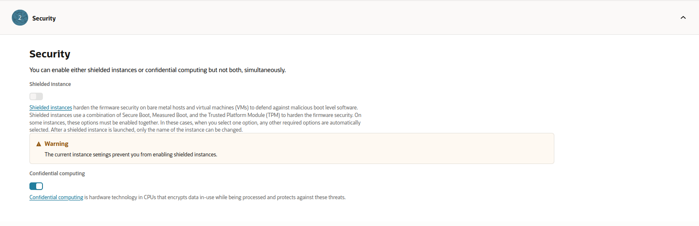

.. meta::
   :description: Learn how to create an instance with confidential computing enabled on Oracle Cloud, including supported shapes, regions, and limitations.

Enable confidential computing
=============================

Ubuntu images on Oracle Cloud Infrastructure support confidential computing on AMD EPYC™ processors. Confidential computing encrypts and isolates in-use data and the applications processing that data, preventing unauthorized access or modification.

Oracle Cloud offers two confidential computing technologies:

* **AMD SEV** (Secure Encrypted Virtualization) — used on virtual machine (VM) shapes. SEV isolates VM guests from the hypervisor through encrypted memory with a unique key per VM.
* **AMD TSME** (Transparent Secure Memory Encryption) — used on bare metal shapes. TSME encrypts all system memory transparently without requiring application changes.

See `AMD documentation`_ for more information about these technologies.

Supported shapes
----------------

The following shapes support confidential computing on Oracle Cloud:

.. list-table::
   :widths: 35 15 25 25
   :header-rows: 1

   * - Shape
     - Type
     - Technology
     - Processor
   * - VM.Standard.E3.Flex
     - VM
     - AMD SEV
     - AMD EPYC Gen 2
   * - VM.Standard.E4.Flex
     - VM
     - AMD SEV
     - AMD EPYC Gen 3
   * - BM.Standard.E3.128
     - Bare Metal
     - AMD TSME
     - AMD EPYC Gen 2
   * - BM.Standard.E4.128
     - Bare Metal
     - AMD TSME
     - AMD EPYC Gen 3
   * - BM.DenseIO.E4.128
     - Bare Metal
     - AMD TSME
     - AMD EPYC Gen 3
   * - BM.Standard.E5.192
     - Bare Metal
     - AMD TSME
     - AMD EPYC Gen 4
   * - BM.DenseIO.E5.128
     - Bare Metal
     - AMD TSME
     - AMD EPYC Gen 4

For the latest list, refer to `Shapes that support confidential computing`_.

Supported regions
-----------------

Confidential computing is available in the following Oracle Cloud regions:

* Germany Central (Frankfurt)
* India South (Hyderabad)
* India West (Mumbai)
* Switzerland North (Zurich)
* UK Gov West (Newport)
* UK South (London)
* US East (Ashburn)
* US West (Phoenix)

For the latest region availability, refer to `Oracle CC documentation`_.

Limitations
-----------

* After enabling confidential computing on an instance, you cannot change its shape.
* Custom images and Marketplace images are not supported with confidential computing.
* The following features are not available with confidential computing:

  * Preemptible capacity
  * Capacity reservation
  * Shielded instances

.. _prerequisites:

Prerequisites
-------------

You'll need:

* A compartment to create the instance in
* (Optional) A Virtual Cloud Network (VCN) to create the instance in. If you don't have one already, you can create a new VCN when you create the instance
* A region that supports confidential computing (see `Supported regions`_ above)
* A shape that supports confidential computing (see `Supported shapes`_ above)

Create a VM instance with confidential computing
-------------------------------------------------

While creating a new instance using :guilabel:`Compute` > :guilabel:`Instances` > :guilabel:`Create instance`, under *Image and shape* select :guilabel:`Change image` > :guilabel:`Ubuntu`. Then choose the desired Ubuntu release and image build that is marked to support the security feature *Confidential computing*.

Example Ubuntu 24.04 LTS images that support confidential computing:

Additionally, under *Image and shape*, select :guilabel:`Change shape` and select a shape that is marked to support *Confidential computing*. If there are no shapes listed that support confidential computing, verify that the region selected has support for confidential computing (refer to `Supported regions`_ above).

For example, the *VM.Standard.E4.Flex* shape supports confidential computing in the *US West (Phoenix)* region:

Finally, under *Security* enable :guilabel:`Confidential computing`.

Create a bare metal instance with confidential computing
--------------------------------------------------------

Bare metal instances use AMD TSME, which encrypts all system memory transparently. To create a bare metal instance with confidential computing:

1. Navigate to :guilabel:`Compute` > :guilabel:`Instances` > :guilabel:`Create instance`.
2. Under *Image and shape*, select :guilabel:`Change image` > :guilabel:`Ubuntu` and choose the desired Ubuntu release.
3. Select :guilabel:`Change shape`, choose :guilabel:`Bare metal machine`, and select one of the supported bare metal shapes (e.g., BM.Standard.E5.192).
4. Under *Security*, enable :guilabel:`Confidential computing`.
5. Complete the remaining instance configuration and launch the instance.

.. note::

   Bare metal confidential instances support any platform image, unlike VM shapes which require images specifically marked for confidential computing support.

Further references
------------------

For more information about creating confidential computing enabled instances, refer to the Oracle Cloud documentation:

* `Creating an Instance <https://docs.oracle.com/en-us/iaas/Content/Compute/Tasks/launchinginstance.htm#top>`_
* `Protect data in use with OCI confidential computing <https://blogs.oracle.com/cloud-infrastructure/post/protect-data-in-use-with-confidential-computing>`_
* `Confidential computing <https://docs.oracle.com/en-us/iaas/Content/Compute/References/confidential_compute.htm>`_

For a general overview of confidential computing technologies, see :doc:`all-clouds:all-clouds-explanation/confidential-computing`.

.. _`AMD documentation`: https://www.amd.com/en/developer/sev.html
.. _`Shapes that support confidential computing`: https://docs.oracle.com/en-us/iaas/Content/Compute/References/confidential_compute.htm#confidential_compute__coco_supported_shapes
.. _`Oracle CC documentation`: https://docs.oracle.com/en-us/iaas/Content/Compute/References/confidential_compute.htm#confidential_compute__coco_support