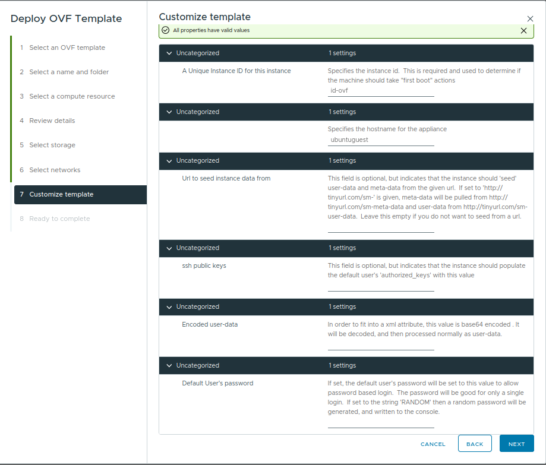

.. meta::
   :description: How to configure an Ubuntu VM using OVF template variables when deploying an OVA on VMware.

Configure your VM using template variables
==========================================

When deploying an Ubuntu OVA in a VMware cluster, the "Customize template" step
(step 7 in the Deploy OVF Template wizard) allows you to configure the VM
through a set of OVF properties. These properties are consumed by
`cloud-init`_ on first boot and drive the initial instance configuration.

   The "Customize template" step in the Deploy OVF Template wizard.

.. note::

   **The default user created by cloud-init on Ubuntu OVA images is** ``ubuntu``.

Available template variables
----------------------------

The following properties can be set during deployment:

instance-id
~~~~~~~~~~~~

A unique identifier for the instance. Cloud-init uses this value to determine
whether the machine should run "first boot" actions. If you redeploy with the
same ``instance-id``, cloud-init will treat the VM as already initialised and
skip first-boot configuration.

* **Default:** ``id-ovf``

hostname
~~~~~~~~

The hostname assigned to the VM.

* **Default:** ``ubuntuguest``

seedfrom
~~~~~~~~

An optional URL from which cloud-init will fetch ``meta-data`` and
``user-data``. For example, if set to ``http://example.com/seed-``, cloud-init
will pull metadata from ``http://example.com/seed-meta-data`` and user-data from
``http://example.com/seed-user-data``.

Leave this empty if you do not want to seed from a URL.

* **Default:** (empty)

public-keys
~~~~~~~~~~~

An SSH public key (or set of keys) to inject into the default user's
``~/.ssh/authorized_keys`` file. This allows SSH key-based login immediately
after deployment.

* **Default:** (empty)

user-data
~~~~~~~~~

Base64-encoded `cloud-init user-data`_. Because OVF properties are XML
attributes, the value must be base64-encoded. Cloud-init will decode and process
it normally on first boot.

For example, the following base64 string encodes ``#!/bin/sh\necho "hi world"``:

.. code-block:: text

   IyEvYmluL3NoCmVjaG8gImhpIHdvcmxkIgo=

You can generate base64-encoded user-data with:

.. code-block:: bash

   base64 -w0 < my-cloud-config.yaml

* **Default:** (empty)

password
~~~~~~~~

If set, the default user's password will be set to this value to allow
password-based login. The password is valid for only a single login (you will be
prompted to change it).

If set to the string ``RANDOM``, a random password will be generated and written
to the VM console.

* **Default:** (empty)

.. note::

   SSH password authentication is disabled by default for security reasons. To
   use this password, you must either log in via the serial console or enable
   SSH password authentication manually through ``user-data``.

Example workflow
----------------

1. In the vSphere Client, select **Deploy OVF Template** and choose the Ubuntu
   OVA file.
2. Proceed through steps 1--6 (name, compute resource, review, storage,
   networks).
3. At step 7 (**Customize template**), fill in the desired properties:

   - Set ``instance-id`` to a unique value for this deployment.
   - Set ``hostname`` to your desired VM hostname.
   - Paste your SSH public key into ``public-keys``.
   - Optionally provide base64-encoded ``user-data`` for advanced cloud-init
     configuration.

4. Complete the wizard and power on the VM. Cloud-init will apply the
   configuration on first boot.

.. _cloud-init: https://cloud-init.io/
.. _cloud-init user-data: https://cloudinit.readthedocs.io/en/latest/explanation/format.html
