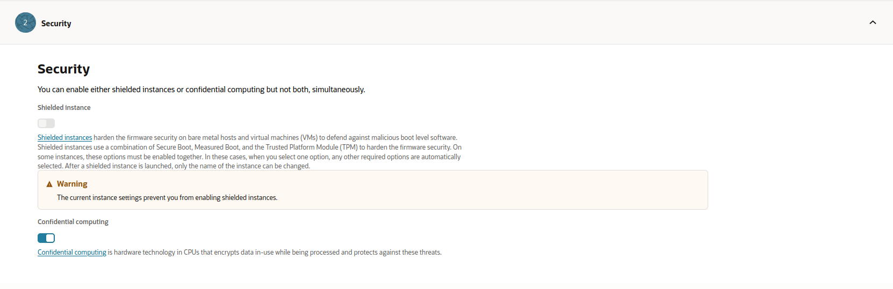

Enable confidential computing
=============================

Ubuntu images on Oracle Cloud Infrastructure support confidential computing on AMD EPYC™ processors. On `OCI E3 and E4 shapes`_ you have access to the AMD confidential computing technology SEV (Secure Encrypted Virtualization). SEV isolates VM guests from the hypervisor through encrypted memory with a key per VM. See `AMD documentation`_ for more information.

.. _prerequisites:

Prerequisites
-------------
You'll need

- a compartment to create the instance in  

- (optional) a Virtual Cloud Network (VCN) to create the instance in. If you don't have one already, you can create a new VCN when you create the instance  

- a region that supports OCI confidential computing (see `Oracle CC documentation`_)

Create an instance with confidential computing
----------------------------------------------

While creating a new instance using :guilabel:`Compute` > :guilabel:`Instances` > :guilabel:`Create instance`, under *Image and shape* select :guilabel:`Change image` > :guilabel:`Ubuntu`. Then choose the desired Ubuntu release and image build that is marked to support the security feature *Confidential computing*.

Example Ubuntu 24.04 images that support confidential computing:

.. image:: enable-confidential-computing/1_ubuntu_images.png

Additionally, under *Image and shape*, select :guilabel:`Change shape` and select a shape that is marked to support *Confidential computing*. If there are no shapes listed that support confidential computing, verify that the region selected has support for confidential computing (refer `Oracle CC documentation`_).

For example, the *VM.Standard.E4.Flex* shape supports confidential computing in the *US West (Phoenix)* region:

.. image:: enable-confidential-computing/2_confidential_shapes.png

Finally, under *Security* enable :guilabel:`Confidential computing`.

Further references
------------------

For more information about creating confidential computing enabled instances, refer to the Oracle Cloud documentation:  

* `Creating an Instance <https://docs.oracle.com/en-us/iaas/Content/Compute/Tasks/launchinginstance.htm#top>`_
* `Protect data in use with OCI confidential computing <https://blogs.oracle.com/cloud-infrastructure/post/protect-data-in-use-with-confidential-computing>`_
* `Confidential computing <https://docs.oracle.com/en-us/iaas/Content/Compute/References/confidential_compute.htm>`_

.. _`AMD documentation`: https://www.amd.com/en/developer/sev.html
.. _`OCI E3 and E4 shapes`: https://docs.oracle.com/en-us/iaas/Content/Compute/References/confidential_compute.htm#confidential_compute__coco_supported_shapes
.. _`Oracle CC documentation`: https://docs.oracle.com/en-us/iaas/Content/Compute/References/confidential_compute.htm#confidential_compute__coco_support