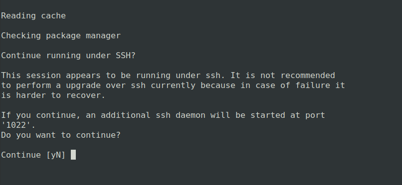
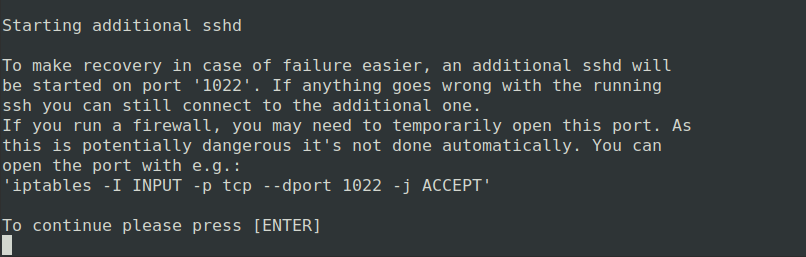
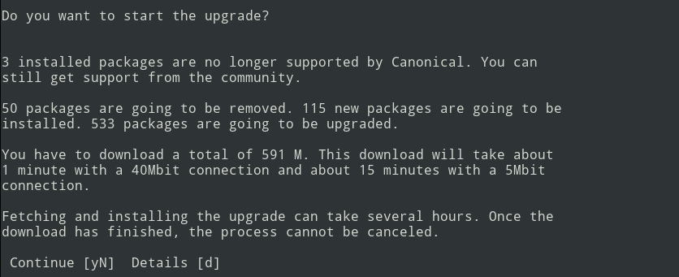
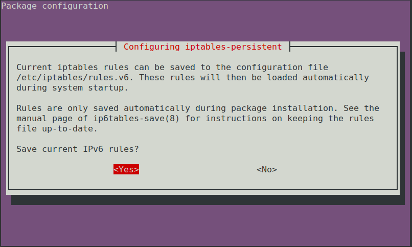
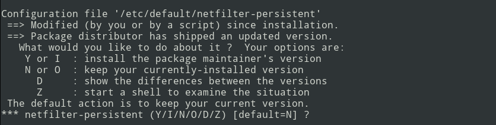
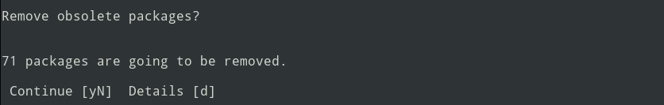
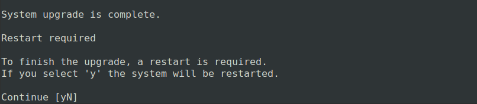

Upgrade from Ubuntu 22.04 LTS (Jammy) to 24.04 LTS (Noble)
==========================================================

General Advice
---------------

Once you have decided to upgrade your system, the next question is how? There are two options depending on whether your system is setup/deployed with automation or whether it requires manual configuration.

For fully automated system deployments it is recommended to redeploy with new Noble instances instead of upgrading from Jammy.

For systems that cannot be easily created or destroyed and require manual configuration, running `do-release-upgrade <https://manpages.ubuntu.com/manpages/jammy/man8/do-release-upgrade.8.html>`_ is a good option. However this option requires some :ref:`manual intervention <manual intervention oracle noble>` as explained below. 

.. warning:: Avoid apt lock conflicts

   Oracle images run ``oracle-cloud-agent`` services that may conflict with the ``do-release-upgrade`` process. To avoid problems, disable the ``oracle-cloud-agent`` and ``unified-monitoring-agent`` services::

      $ sudo snap stop oracle-cloud-agent

      $ sudo systemctl stop unified-monitoring-agent

   These services will automatically restart after you complete the system reboot at the end of the upgrade process.

.. _manual intervention oracle noble:

Manual intervention steps
-------------------------

While upgrading from Jammy to Noble, manual decision making will be needed for the following options that are presented.

Additional SSH daemon
~~~~~~~~~~~~~~~~~~~~~

When upgrading in a session over SSH there is an inherent risk of losing access if something goes wrong with the SSH daemon. To mitigate this risk an additional SSH daemon is started on a different port as a backup.

The prompt notifies you that an additional SSH daemon will be started and you can either continue or cancel the upgrade.

Optional firewall rules for additional SSH daemon
~~~~~~~~~~~~~~~~~~~~~~~~~~~~~~~~~~~~~~~~~~~~~~~~~

If you are using a firewall there is a chance that the port used by the backup SSHD is not open. Opening this port is not done automatically since it could be security risk. An optional command to open the port is provided and you are prompted to press enter to continue.

Start upgrade
~~~~~~~~~~~~~
A final prompt is provided before starting the upgrade. It gives information about the number of changes and the estimated time to complete because once started, the upgrade process cannot be canceled. At this stage you can continue, cancel or see additional details.

   

Configuration of iptables modified
~~~~~~~~~~~~~~~~~~~~~~~~~~~~~~~~~~

Canonical makes changes to ``/etc/iptables/rules.v4`` and ``/etc/iptables/rules.v6`` for Oracle images. As a result, during upgrade you'll see a prompt asking whether you want to save the current IPv4 and IPv6 rules even if no user changes were made. If you have made additional changes to the iptables and want to preserve those added rules, select ``Yes``. Selecting ``No`` will use the preexisting persistent ``rules.v4`` and ``rules.v6`` which contain the Canonical changes, unless previously modified.

Configuration of netfilter modified
~~~~~~~~~~~~~~~~~~~~~~~~~~~~~~~~~~~

Canonical makes changes to ``/etc/default/netfilter-persistent`` for Oracle Cloud images. As a result, during upgrade you'll see a prompt notifying you about the availability of a newer version of the netfilter-persistent file. You'll be asked if you want to keep the existing modified version, use the default one from the new upgrade, or take some other action. The recommend action is to select ``N`` to keep your currently installed version. Selecting ``Y`` to install the package maintainer's version may break network connectivity after reboot.

Remove obsolete packages
~~~~~~~~~~~~~~~~~~~~~~~~

An obsolete package is a package which is no longer available in any of the sources for apt. Usually it is safe and recommended to remove obsolete packages. But before doing so you'll be asked if you wish to remove them and you'll have the option to select from yes, no and more details.

Restart to finish upgrade
~~~~~~~~~~~~~~~~~~~~~~~~~

Finally, a restart will be necessary for some parts of the upgrade to be applied. If you select no, you can use ``/var/run/reboot-required.pkgs`` to check for the packages that need a reboot.

