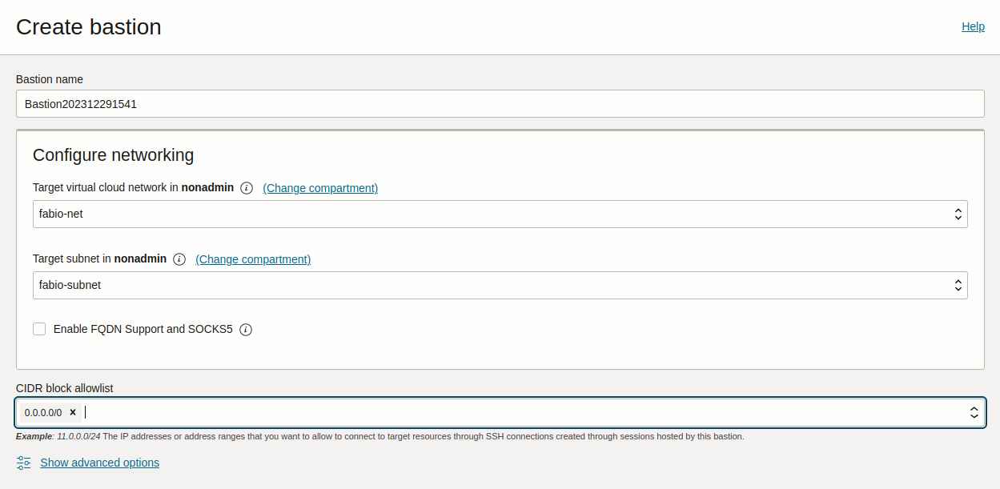

Use a bastion to access your VM
===============================

To increase security and avoid Internet based attacks, it might make sense to run your VMs without a public IP address and just use a private IP instead. The only way to access such a VM will be through your private network in the Oracle Cloud VNC (Virtual Cloud Network).

`Oracle's bastion feature`_ provides a time-limited access to VMs without a public endpoint. Bastions control authorised users and allow them to SSH into a VM from specific IP addresses. It also negates the need to maintain an instance with a public and private address to act as a bastion (which in turn runs the risk of Internet exposure).

To use a bastion, as a prerequisite you'll need your VCN to include a gateway (a service gateway, an internet gateway, or a NAT gateway) and a route rule for the gateway. For details on how to handle these services, refer to the Oracle Cloud documentation at `Service Gateway`_, `Internet Gateway`_, or `NAT Gateway`_.

Create the IAM policy
---------------------

If you are not an Administrator, you need to request the administrator of your Oracle Cloud tenancy to create an IAM policy granting access for you to use bastions. This will allow you to create bastions and operate it through the console, CLI or API.

Refer to the Oracle Cloud documentation for details on how to create the `required IAM Policy`_. It contains an example of the policy statements that the administrator can use to grant access to services in the whole tenancy, and that can be optionally restricted to a single compartment if desired.

You can create the policy using the console or the CLI.

.. tabs::

    .. tab:: Using console

        Go to :guilabel:`Identity & Security` > :guilabel:`Identity` > :guilabel:`Policies` and select the compartment where you want to create the policy (or root if you want to create a policy for the whole tenancy).
        
        Select :guilabel:`create policy` and provide a name and description. In the *Policy Builder* section, enable :guilabel:`Show manual editor` and paste your policy statements (as from the example in the Oracle Cloud documentation).

        .. image:: use-bastion-to-access-VM-images/1_create_policy.png
            :align: center
    
    .. tab:: Using CLI

        Run:

        .. code::

            oci iam policy create \
                --compartment-id <compartment_id> \
                --description "Allow members of the Users group to create and operate bastions" \
                --name bastionpolicy \
                --statements  '["Allow group Users to manage bastion-family in tenancy", \
                                "Allow group Users to manage virtual-network-family in tenancy", \
                                "Allow group Users to read instance-family in tenancy", \
                                "Allow group Users to read instance-agent-plugins in tenancy", \
                                "Allow group Users to inspect work-requests in tenancy"]' \
                --region <home_region>
        
        When creating the policy through the CLI, you must use your home region.

Install oracle-cloud-agent on the VM
------------------------------------

If you are using the images created by Canonical and published by Oracle (as described in :doc:`find-ubuntu-images`), they already have the oracle-cloud-agent pre-installed by default, and no additional action is necessary.

To check if the agent is installed, run:

.. code::

    sudo snap list
    sudo snap info oracle-cloud-agent

To install the agent, run:

.. code::

    sudo snap install oracle-cloud-agent

Enable the bastion plugin on the VM
-----------------------------------

On the Oracle Cloud console, go to your instance, navigate to the *Oracle Cloud Agent* tab and enable the Bastion plugin (it is disabled by default):

.. image:: use-bastion-to-access-VM-images/2_enable_bastion_plugin.png

Even though enabled, the status will initially show up as *Stopped*. It might take up to 10 minutes for the plugin to start running in the VM. Wait until the status changes to *Running* before proceeding.

Create a bastion
----------------

When the bastion plugin shows up as *Running* in the cloud console, you should see a new log directory created inside the VM under ``/var/log/oracle-cloud-agent/plugins/bastions/``. Also, if you look at ``/var/log/oracle-cloud-agent/agent.log``, you should see indications that the plugin has started, something similar to:

.. code::

    2023/12/29 18:30:48.004902 health.go:107: health check of plugin:[bastions], desiredState:[Enable], currentState:[notStarted], status:[yet to start] version:[v0.0.0] err:[<nil>]
    2023/12/29 18:30:48.004912 orphan.go:28: cleaning orphans of plugin:[bastions] with signal SigTerm
    2023/12/29 18:30:48.008749 orphan.go:33: cleaning orphans of plugin:[bastions] with signal SigKill
    2023/12/29 18:30:48.011165 health.go:137: starting plugin:[bastions] 
    2023/12/29 18:30:48.011180 plugin.go:52: creating plugin:[bastions], elevated: false, runas: , exe: /var/snap/oracle-cloud-agent/common/bastions
    2023/12/29 18:30:48.203266 health.go:145: started plugin:[bastions]

Now to create a bastion, go to :guilabel:`Identity & Security` > :guilabel:`Bastion` and select :guilabel:`Create bastion`. Provide a name and select the network and subnet where the bastion should be created.

Under ``CIDR block allowlist``, specify the network range from which you want to provide access to your bastion. For instance, you can restrict the bastion access to only valid IP addresses that your ISP assigns to you, so that it would be accessible only from your network. Note that currently, only IPv4 ranges are allowed. 

If you want a less secure approach, you can let the bastion be accessed by any address, as in the example below:

Create a session to access the VM
---------------------------------

Once the bastion goes into an *Active* state, select your bastion and choose :guilabel:`Create session`. Fill in the details:

* Session type: Managed SSH session
* Session name: any name of your choice
* Username: ubuntu  (if your VM is an Ubuntu instance, the default user is ubuntu)
* Compute instance: <the VM that you would like to access through the bastion>
* Add SSH key: Add a public SSH key to inject into the bastion (you must have access to the private key so you can access it)

.. image:: use-bastion-to-access-VM-images/4_create_session.png

Access the VM
-------------

When the session is created, use the *Copy SSH command* from the 3 dots menu to get a command similar to:

.. code::

    ssh -i <privateKey> -o ProxyCommand="ssh -i <privateKey> -W %h:%p -p 22 ocid1.bastionsession.oc1.sa-saopaulo-1.amaaaaaaniwq6sya34ss2bksayws7o4lovrtmvxg3e3baqb64vxw7nz447kq@host.bastion.sa-saopaulo-1.oci.oraclecloud.com" -p 22 ubuntu@10.0.0.86

This will create a tunnel through the public hostname of the bastion to the private IP address of your VM. Replace ``<privateKey>`` with the path of your private key, and you should have SSH access to your VM using the bastion.

.. _`Oracle's bastion feature`: https://docs.oracle.com/en-us/iaas/Content/Bastion/Concepts/bastionoverview.htm
.. _`Service Gateway`: https://docs.oracle.com/en-us/iaas/Content/Network/Tasks/servicegateway.htm
.. _`Internet Gateway`: https://docs.oracle.com/en-us/iaas/Content/Network/Tasks/managingIGs.htm
.. _`NAT Gateway`: https://docs.oracle.com/en-us/iaas/Content/Network/Tasks/NATgateway.htm
.. _`required IAM Policy`: https://docs.oracle.com/en-us/iaas/Content/Bastion/Tasks/managingbastions.htm#managingbastions_topic-Required_IAM_Policy

