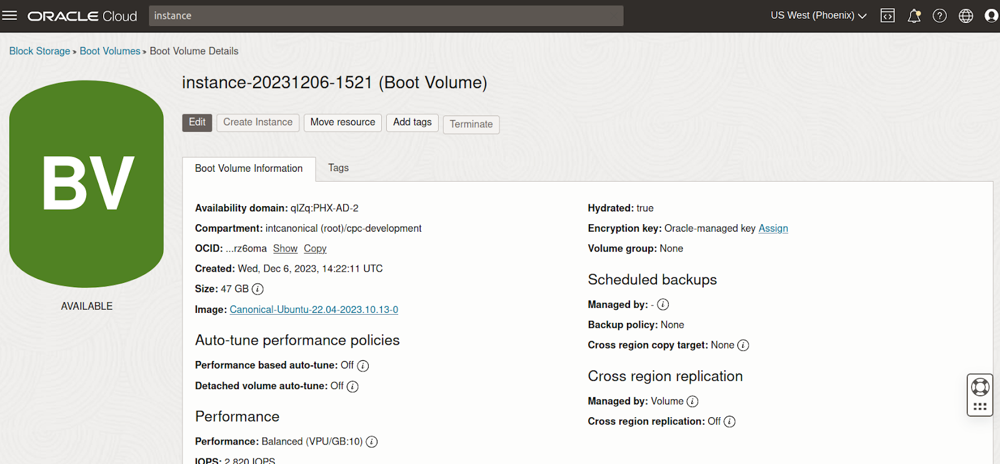

Use full-disk encryption (FDE)
==============================

When an instance is launched on Oracle Cloud, its disk (“boot volume”) is encrypted by default using an Oracle managed key. Disk encryption is enabled by default and cannot be turned off. Any other disks added to expand an instance's storage are also encrypted by default.

If needed, you can also use your own key to encrypt the disks, as described in this guide.

Prerequisites
-------------

You'll need:

- a compartment to create the instance in.

- (optional) a Virtual Cloud Network (VCN) to create the instance in. If you don't have one already, you can create a new VCN when you create the instance.

- (optional) a Vault with encryption keys to use for boot volume encryption. This is only necessary if you wish to use your own encryption key for FDE.

Create an instance with personalised FDE
----------------------------------------

While creating a new instance using :guilabel:`Compute` > :guilabel:`Instances` > :guilabel:`Create instance`, under *Image and shape* select :guilabel:`Change image` > :guilabel:`Ubuntu`. Then choose the desired Ubuntu release and image build.

An Oracle managed key is used by default to encrypt the boot volume. But if you want to use your own key, under the advanced options in *Boot volume* select :guilabel:`Encrypt this volume with a key that you manage` and follow the instructions described in Oracle's documentation about `using your own keys`_.

.. image:: use-fde-images/1_own_key_encryption.png

Additionally, if you enable :guilabel:`Use in-transit encryption`, the data moving between the instance and the block volume will also be encrypted.

Change the encryption key (optional)
------------------------------------

The encryption key for a boot volume can also be changed after it has been created. To do that navigate to the instance details page and under *Resources*, select :guilabel:`Boot volume`. From the list of available boot volumes, browse to the details of the one that you want to modify. It should look similar to:

Locate *Encryption key*, select :guilabel:`Edit` or :guilabel:`Assign` (the label depends on whether a key is already assigned to the volume or not) and put in the details for the new key.

For more options on how to do this, refer to Oracle's documentation for `editing a block volume's key`_.

Further references
------------------

For more information about encryption on Oracle Cloud, refer to the Oracle Cloud documentation:

* `Encrypting data`_
* `OCI Vault overview`_
* `Block volume encryption`_

.. _`using your own keys`: https://docs.oracle.com/en-us/iaas/Content/Object/Tasks/encryption.htm#Using_Your_Own_Keys_for_ServerSide_Encryption
.. _`editing a block volume's key`: https://docs.oracle.com/en-us/iaas/Content/KeyManagement/Tasks/assigningkeys_topic-To_assign_a_key_to_an_existing_Block_Volume.htm#assignkeyexistingblockvolume
.. _`Encrypting data`: https://docs.oracle.com/en-us/iaas/Content/Object/Tasks/encryption.htm
.. _`OCI Vault overview`: https://docs.oracle.com/en-us/iaas/Content/KeyManagement/Concepts/keyoverview.htm
.. _`Block volume encryption`: https://docs.oracle.com/en-us/iaas/Content/Block/Concepts/overview.htm#BlockVolumeEncryption

