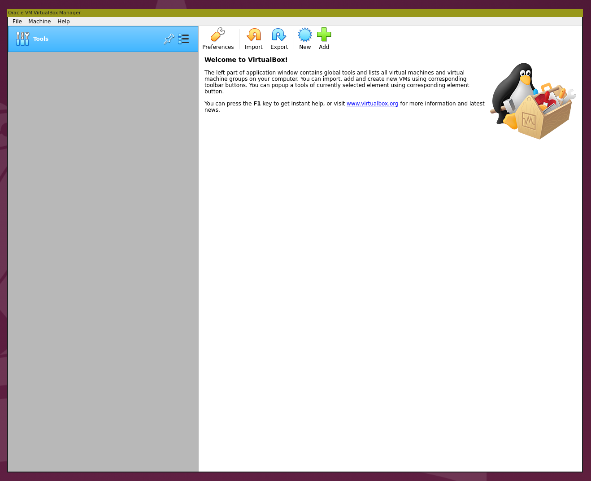
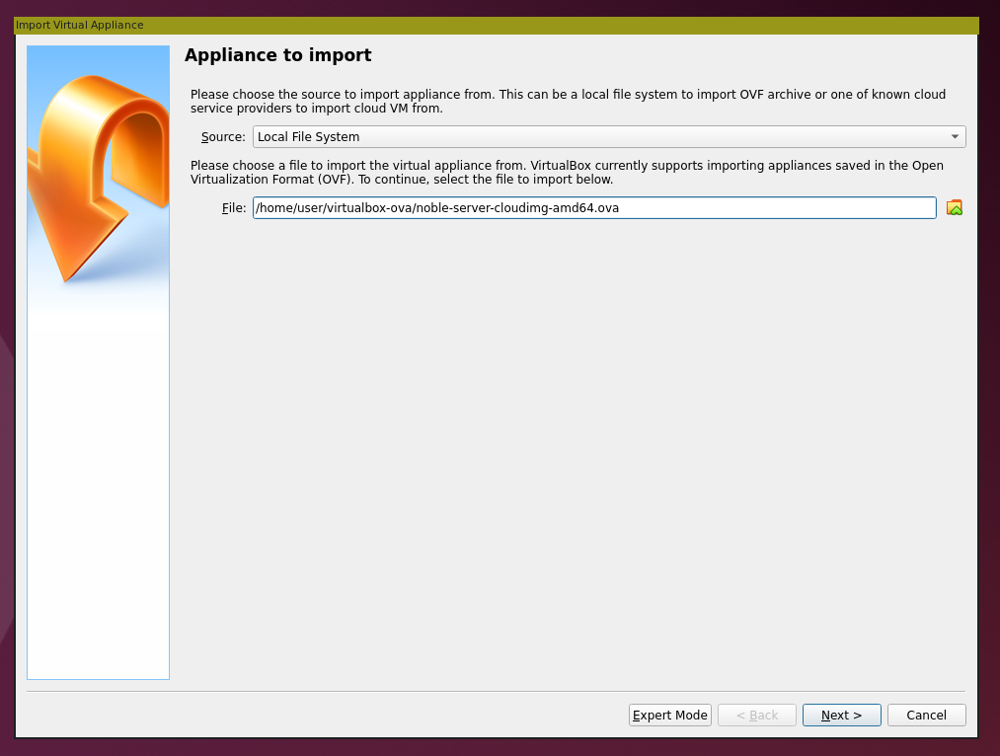
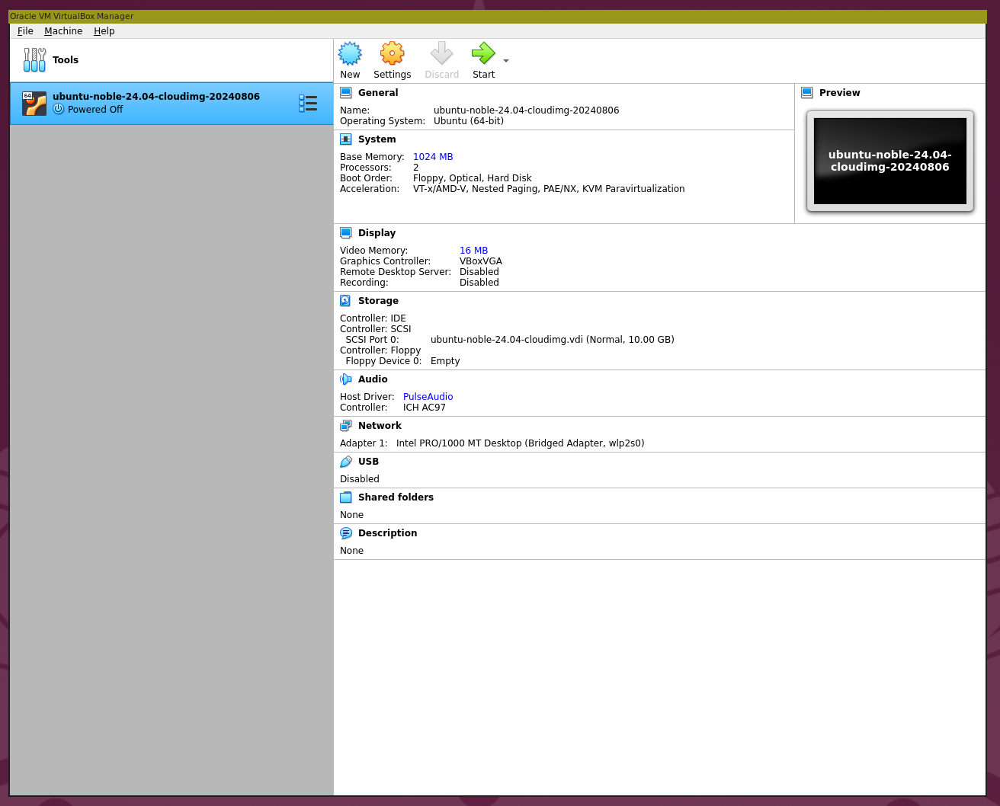
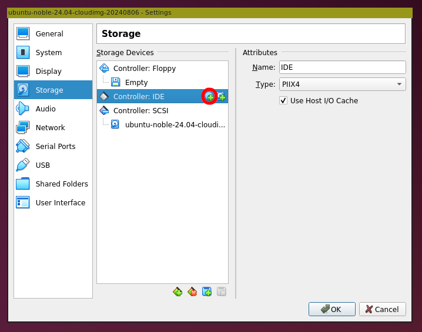
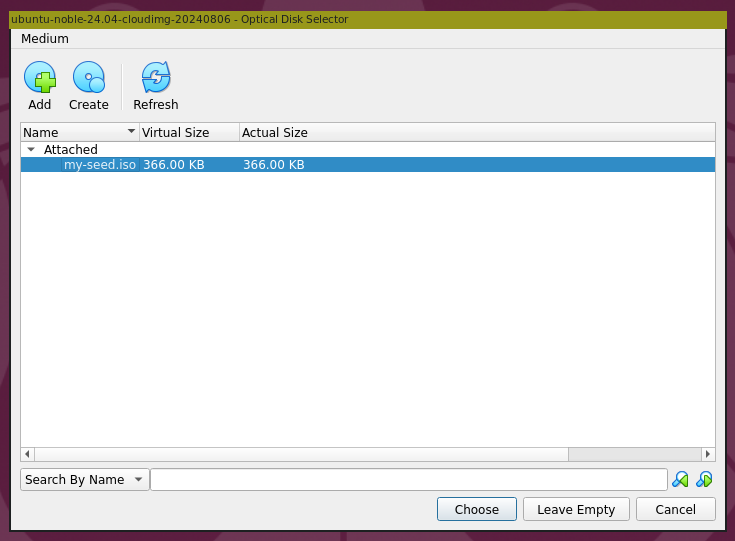

.. _run-an-ova-using-virtualbox:

Run an OVA using VirtualBox
===========================

An :ref:`ova-ref` is a single file package that allows for easy distribution and
setup of virtual machines (VMs). `VirtualBox <https://www.virtualbox.org/>`__ is an open source
virtualization platform that allows you to use OVA files to create and
manage VMs. This guide will cover how to acquire an OVA file,
install VirtualBox, and configure and launch an Ubuntu VM that you can connect
to via the virtual console or over SSH.

Download an OVA
---------------

The easiest way to get an OVA is to download one from
`cloud-images.ubuntu.com <https://cloud-images.ubuntu.com>`__. You can
get the latest daily OVA for a given
``$SERIES`` by downloading ``https://cloud-images.ubuntu.com/$SERIES/current/$SERIES-server-cloudimg-amd64.ova``.

Create a new directory and get the latest daily for Ubuntu 24.04
LTS (Noble Numbat).

.. code:: bash

  mkdir virtualbox-ova
  cd virtualbox-ova/
  wget https://cloud-images.ubuntu.com/noble/current/noble-server-cloudimg-amd64.ova

Install VirtualBox
------------------

There are two ways of getting VirtualBox depending on whether you
are on an Ubuntu system or not.

From the Ubuntu archive
~~~~~~~~~~~~~~~~~~~~~~~

If you are on Ubuntu, the simplest way to get VirtualBox is from the
Ubuntu archive, the official repository provided by Ubuntu.

.. code:: bash

  sudo apt update
  sudo apt install virtualbox

From the upstream source
~~~~~~~~~~~~~~~~~~~~~~~~

Alternatively, you can download VirtualBox from the `upstream
source <https://www.virtualbox.org/wiki/Downloads>`__. Use the instructions
provided there for installing VirtualBox on your OS.

Import the OVA into the VirtualBox
----------------------------------

Start VirtualBox:

Select :guilabel:`Import` to add our OVA as a virtual appliance:

On the next screen you can modify the appliance settings by double-clicking
on them, or by enabling/disabling the appropriate check boxes:

.. image:: run-an-ova-using-virtualbox-images/2-appliance-settings.png
   :align: center

Once imported, the appliance will be visible on the left side bar of the
VirtualBox home screen:

Before attempting to run the appliance however, you'll need to generate
and attach an ISO image containing configuration data for cloud-init.
cloud-init uses that data to initialize the instance during initial boot.
This step is needed since we are using a cloud image instead of a standard
desktop image. To learn more about creating and using a local cloud-init
datasource, refer to :ref:`use-local-cloud-init-ds`.

Create and attach an ISO image
------------------------------

To create an ISO image we'll use the ``cloud-localds`` function from
the ``cloud-utils`` package. On Ubuntu and Debian systems you can install
this via apt:

.. code:: bash

  sudo apt install cloud-utils

For other operating systems, follow the instructions from the
`cloud-utils upstream repository <https://github.com/canonical/cloud-utils>`_.

Additionally, to set up remote access for your machine, you'll need to have
a set of SSH keys. To learn more about SSH keys and their generation, refer
to `SSH/OpenSSH/Keys <https://help.ubuntu.com/community/SSH/OpenSSH/Keys>`_.

Once these prerequisites are met, you can generate and attach the
ISO seed image.

1. Create a YAML file with password authorization enabled:

Choose between two YAML configurations based on your cloud-init version

.. tabs::

  .. group-tab:: cloud-init >= 22.3

    .. code:: bash

      cat <<EOF > my-cloud-config.yaml
      #cloud-config
      chpasswd:
        users:
        - {name: ubuntu, password: ubuntu, type: text}
        expire: False
      ssh_pwauth: True
      ssh_authorized_keys: <YOUR_PUB_KEY>
      EOF
      
  .. group-tab:: cloud-init < 22.3

    .. code:: bash

      cat <<EOF > my-cloud-config.yaml
      #cloud-config
      chpasswd:
        list: |
          ubuntu:ubuntu
        expire: False
      ssh_pwauth: True
      ssh_authorized_keys: <YOUR_PUB_KEY>
      EOF

Replace ``<YOUR_PUB_KEY>`` with your public key.

2. Create the ISO image:

.. code:: bash

  cloud-localds my-seed.iso my-cloud-config.yaml

3. Attach the ISO as an optical drive:

From the VirtualBox main menu, select the OVA image on the left side bar,
right-click on it and choose :guilabel:`Settings` > :guilabel:`Storage`:

To add an optical drive, select the +CD icon beside :guilabel:`Controller:IDE`.
Then use :guilabel:`Add` to specify the ``my-seed.iso`` created above and
finally select :guilabel:`Choose`:

You are now ready to launch the VM.

Launch the VM
-------------

From the VirtualBox main menu, select :guilabel:`Start`. This will start
the launch process for your VM and may take some time to complete.

.. image:: run-an-ova-using-virtualbox-images/6-vm-login-prompt.png
   :align: center

When you reach the ``ubuntu login:`` prompt, enter the username and
password from the YAML file above. If you didn’t change the template,
both the username and password will be ``ubuntu``.

.. image:: run-an-ova-using-virtualbox-images/7-vm-logged-in.png
   :align: center

Success! Run some commands to ensure that everything is set up correctly.

-  Verify that you can access the internet:

.. code:: bash

   ping -c 3 ubuntu.com

-  Check your IP configuration (needed for connecting via SSH):

.. code:: bash

   ip a

-  Verify that the SSH service is running:

.. code:: bash

   sudo systemctl status ssh

-  Check disk configuration:

.. code:: bash

   df -h

When you are done with your session, you can turn off the VM by
selecting :guilabel:`File` > :guilabel:`Close` from the top bar
menu of the window running the machine. Other options are also
available under the :guilabel:`Machine` heading.

Connect via SSH
---------------

To connect via SSH, we'll make use of the bridged network adapter
that was configured during the appliance setup. You'll need the IP 
address of the VM. On the virtual console of the (running) VM, run:

.. code:: bash

  ip a

to get something like:

.. terminal::

   $ ip a
   1: lo: <LOOPBACK,UP,LOWER_UP> mtu 65536 qdisc noqueue state UNKNOWN
       group default qlen 1000
       link/loopback 00:00:00:00:00:00 brd 00:00:00:00:00:00
       inet 127.0.0.1/8 scope host lo
       valid_lft forever preferred_lft forever
   2: enp0s3: <BROADCAST,MULTICAST,UP,LOWER_UP> mtu 1500 qdisc fq_codel
       state UP group default qlen 1000
       link/ether xx:xx:xx:xx:xx:xx brd ff:ff:ff:ff:ff:ff
       inet 192.168.1.123/24 brd 192.168.1.255 scope global dynamic enp0s3
       valid_lft 86389sec preferred_lft 86389sec

Ignore the ``loopback (lo)`` interface and use the ethernet interface
(``enp0s3``) to get the IP address. It's on the line starting with ``inet``
and in this case it is ``192.168.1.123``.

After ensuring that the VM is running, you can now log in via SSH from your
host terminal with the command ``ssh $USERNAME@$IP_ADDRESS``.

.. code:: bash

  ssh ubuntu@192.168.1.123

If this is the first time you're connecting to this VM, you'll have to
confirm that you want to connect.

.. terminal::

  $ ssh ubuntu@192.168.1.123
  The authenticity of host ‘192.168.1.123 (192.168.1.123)’ can’t be
  established.
  ED25519 key fingerprint is
  SHA256:7vJHf4BcNaZ9dQKSPG8tFw3uRlXnV1kTbmYgEjL0h5o.
  This key is not known by any other names
  Are you sure you want to continue connecting (yes/no/[fingerprint])?
  yes
  Warning: Permanently added ‘192.168.1.123’ (ED25519) to the list of
  known hosts.

Once done, disconnecting from the SSH session will not power down the
VM unless you explicitly called ``poweroff`` or another similar command.
